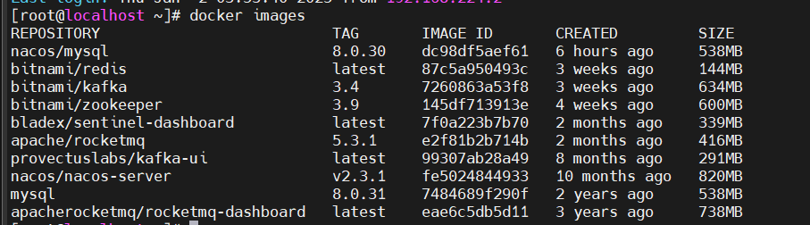

# DockerNotes-单机

## 基础操作

### 1. 下载、启动Docker

```bash
# 下载
sudo curl -fsSL https://gitee.com/tech-shrimp/docker_installer/releases/download/latest/linux.sh| bash -s docker --mirror Aliyun

# 启动
sudo service docker start
```

### 2. 获取镜像

#### 虚拟机

##### 方法一：镜像换源

通过修改镜像源来获取镜像

```bash
# 修改镜像地址配置
sudo vi /etc/docker/daemon.json

# 更新地址
{
    "registry-mirrors": [
        "https://docker.m.daocloud.io",
        "https://docker.1panel.live",
        "https://hub.rat.dev"
    ]
}

# 重启docker
sudo service docker restart
```

##### 方式二：使用代理

对于虚拟机直接使用Tun代理可以快速解决问题

以Clash为例，开启Tun代理，如图：


#### 服务器

服务器进行镜像获取较为麻烦，可以通过以下几种方式解决

##### 方式一：镜像换源

（部分Linux服务器修改了镜像源之后可能还是无法生效，可以加上特定镜像源前缀后再拉取）

从指定镜像源拉取镜像

```bash
# 首先找到一个可用镜像源，比如：https://hub.rat.dev

# 通过加上镜像源前缀的方式拉取
docker pull hub.rat.dev/<镜像名>:[版本号]
```

##### 方式二：配置代理

（据说可能导致服务器被查封，因此我选择的是方式一.镜像换源）

## 运行容器

### 1. 查看仓库镜像

```bash
# 查看镜像指令
docker images
```



### 2. 运行容器

#### 方法一：docker run

```bash
# 简单运行一个nginx容器
docker run --name my-nginx -p 8080:80 -d nginx

# 运行一个java程序
docker run \
  --name my-java-app \
  -p 8080:8080 \
  -v /path/to/app:/app \
  -v /path/to/logs:/logs \
  -e JAVA_OPTS="-Xms512m -Xmx1024m -XX:+UseG1GC" \
  -w /app \
  -d openjdk:17 \
  java $JAVA_OPTS -jar app.jar
```

详细参数可见菜鸟教程：


#### 方法二：docker compose

```bash
# docker compose示例
services:
  # redis配置
  redis:
    image: bitnami/redis:latest
    restart: always
    container_name: redis
    environment:
      - REDIS_PASSWORD=123456
    ports:
      - '6379:6379'
    volumes:
      - /app/data/redis/redis-data:/bitnami/redis/data
      - /app/data/redis/redis-conf:/opt/bitnami/redis/mounted-etc
      - /etc/localtime:/etc/localtime:ro
```

docker compose的方式优点是好进行跟踪和更新，且如果是虚拟机的测试环境每次开机启动docker compose 即可

```bash
# 进入到存放docker-compose.yaml文件的目录
cd /mycompose

# 执行docker compose指令
docker compose up -d
```

> 注：在当前目录下的 `compose.yaml` 文件中记录了常用镜像及其典型的 Compose 参数配置。根据实际需求调整这些配置，可实现快速部署目标。