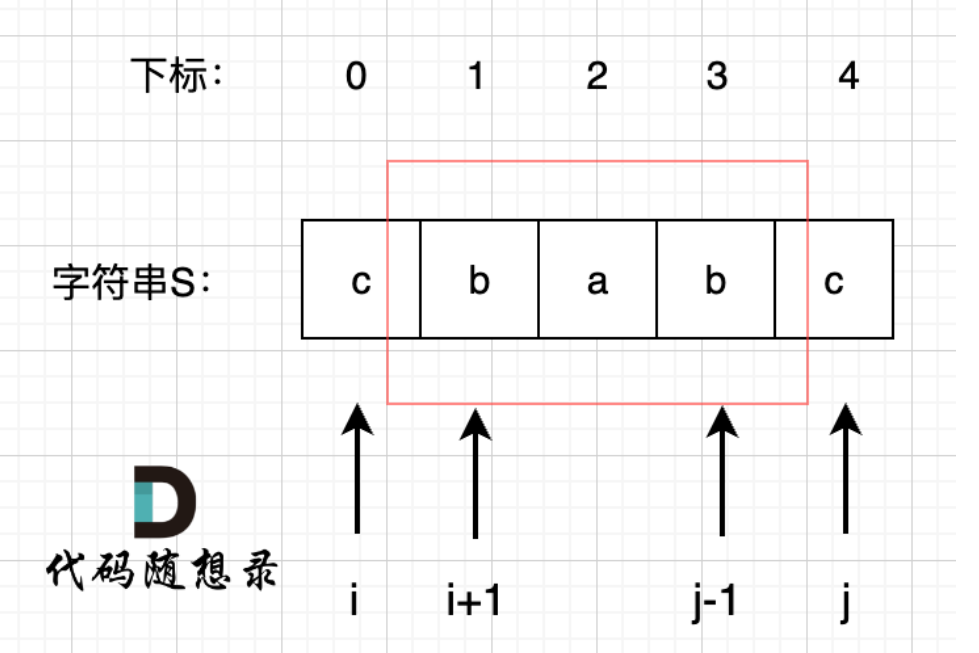

# 647. 回文子串

## 题目描述：

给你一个字符串 `s` ，请你统计并返回这个字符串中 **回文子串** 的数目。

**回文字符串** 是正着读和倒过来读一样的字符串。

**子字符串** 是字符串中的由连续字符组成的一个序列。

**示例 1：**

```
输入：s = "abc"
输出：3
解释：三个回文子串: "a", "b", "c"
```

**示例 2：**

```
输入：s = "aaa"
输出：6
解释：6个回文子串: "a", "a", "a", "aa", "aa", "aaa"
```

**提示：**

+ `1 <= s.length <= 1000`
+ `s` 由小写英文字母组成

## 解题思路：



`dp[i][j]`表示s的i到j是不是回文子串，三种情况：

1. `i==j`，单个字符一定是回文子串
2. `j-i==1`，两个字符，也一定是子串
3. `j-i>1`，这时候要根据`dp[i+1][j-1]`进行判断

因为第三种情况依赖于大的i和小的j，因此遍历顺序是i递减，j递增

## 代码：

```java
class Solution {
    public int countSubstrings(String s) {
        int n = s.length();
        // dp[i][j]表示s的i到j是不是回文子串
        boolean[][] dp = new boolean[n][n];
        int res = 0;
        // dp[i][j]依赖于dp[i+1][j-1]，因此需要i递减，j递增进行遍历
        for (int i = n - 1; i >= 0; i--) {
            for (int j = i; j < n; j++) {
                if (s.charAt(i) == s.charAt(j)) {
                    if (j-i <= 1) {
                        res++;
                        dp[i][j] = true;
                    } else if (dp[i + 1][j - 1]) {
                        res++;
                        dp[i][j] = true;
                    }
                }
            }
        }
        return res;
    }
}
```


