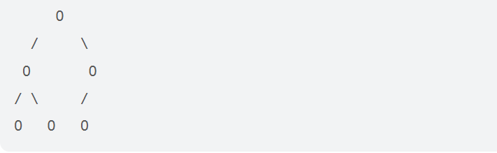
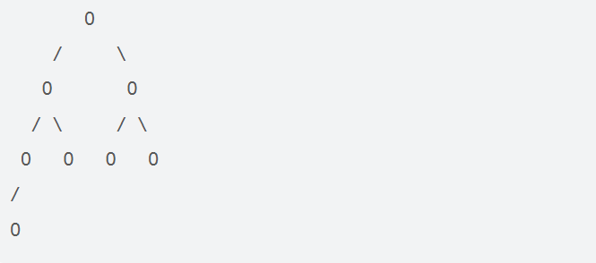

# 222.完全二叉树的节点个数

## 题目描述：

给你一棵 **完全二叉树** 的根节点 `root` ，求出该树的节点个数。

[完全二叉树](https://baike.baidu.com/item/完全二叉树/7773232?fr=aladdin) 的定义如下：在完全二叉树中，除了最底层节点可能没填满外，其余每层节点数都达到最大值，并且最下面一层的节点都集中在该层最左边的若干位置。若最底层为第 `h` 层，则该层包含 `1~ 2h` 个节点。

 

**示例 1：**


```
输入：root = [1,2,3,4,5,6]
输出：6
```

**示例 2：**

```
输入：root = []
输出：0
```

**示例 3：**

```
输入：root = [1]
输出：1
```

 

**提示：**

+ 树中节点的数目范围是`[0, 5 * 104]`
+ `0 <= Node.val <= 5 * 104`
+ 题目数据保证输入的树是 **完全二叉树**

**进阶：**遍历树来统计节点是一种时间复杂度为 `O(n)` 的简单解决方案。你可以设计一个更快的算法吗？

## 解题思路：

常规解法：迭代法或者递归法逐个遍历，时间复杂度是O(n)

进阶解法：根据满二叉树的性质可知，如果一棵树是满二叉树，那么从节点出发，左右子树高度相同。

易知：左右子树高度相同，左树满二叉，公式计算，右树递归计算。



左右子树高度不同，右树高度为左树高度-1，满二叉，公式计算。左树递归计算



 注意：递归调用原函数，则在递归的过程中，左右子树还会进行高度计算的优化。因此实际速度很快。

## 代码：

```java
//常规做法
class Solution {
    int sum=0;
    public int countNodes(TreeNode root) {
        if(root==null) return 0;
        Queue<TreeNode> queue=new LinkedList<>();
        queue.add(root);
        while(!queue.isEmpty()){
            int len = queue.size();
            sum+=len;
            while(len!=0){
                TreeNode node = queue.poll();
                if(node.left!=null) queue.add(node.left);
                if(node.right!=null ) queue.add(node.right);
                len--;
            }
        }
        return sum;
    }
}


// 进阶做法
class Solution {
    public int countNodes(TreeNode root) {
        if(root == null){
           return 0;
        } 
        int left = countLevel(root.left);
        int right = countLevel(root.right);
        if(left == right){
            return countNodes(root.right) + (1<<left);
        }else{
            return countNodes(root.left) + (1<<right);
        }
    }
    private int countLevel(TreeNode root){
        int level = 0;
        while(root != null){
            level++;
            root = root.left;
        }
        return level;
    }
}

```

