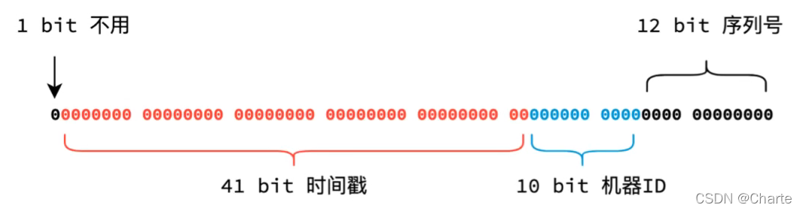
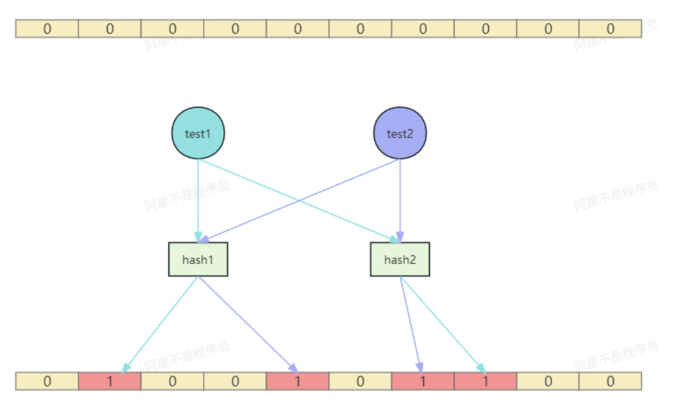
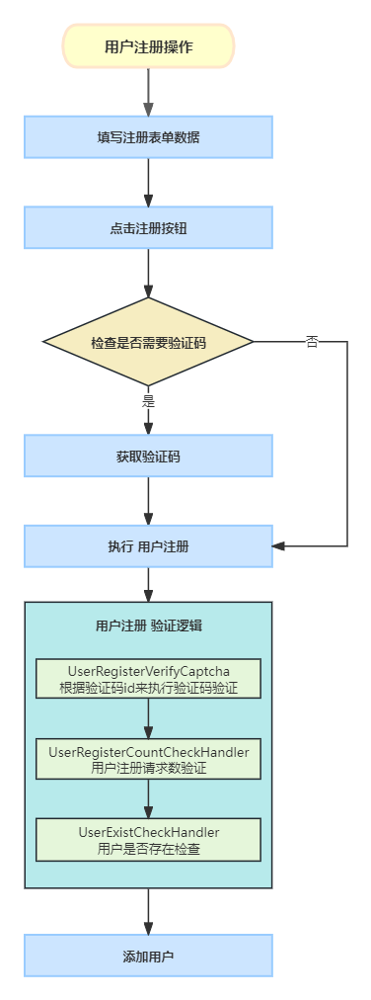

# 大麦项目笔记——业务功能

## 分库分表

关键：选择好**分片键**，减少**全路由**情况

### 一般做法

大部分分库分表就是通过**常用字段**进行分库分表，比如**id**，或者是program库中的seat表通过**强相关的programId**去分表。

### 特殊分片键

#### 1. 附属表

额外维护了user_phone和user_email表，原因：

用户登录的时候用的是手机号或者邮箱，但是如果我们没有额外维护这两张表，则用户进行信息查询的时候会发生全路由。

目前采取的做法是：通过手机号/邮箱查询userId，然后拿着userId去查询userInfo，这样虽然会发生两次查询，但是都不会产生全路由，效率会比直接全路由查询要高

#### 2. 基因法+雪花算法改造

使用基因法对orderId进行改造，原因：

我们希望通过userId和orderId两种方式进行订单查询，但是分片键只能有一个，根据基因法，我们可以对orderId进行改造。

基因法：

```bash
32 = 100000
31 % 32 = 11111(5个1 也就是32取log2次数)
如果把任意一个数x的后五位改造成11111，那么x%32 = 11111
```

因此我们对雪花算法进行改造：



把orderId后面的**序列号**改成是 **userId % 分表数量** 的值。

这样一来，我们进行表查询的时候，只需要拿到**userId/orderId**，然后对**分表数量取模**就行。就能快速定位到表。

进行数据库查询稍微麻烦一点，不能直接使用取模（之前创建orderId是根据表数量来的）。不过也是利用了相同的**基因**，对**分库数	量取模也相同**的性质。进行数据库快速定位

思考：这样的设计会不会产生问题？

原因：**基因替换破坏了原本的序列号**，这个序列号的作用是在时间戳和机器ID相同的情况下作为标识的，会不会导致无法区分orderId

答：是在**本业务中不会有问题**，因为本业务的基因法替换是**创建order**的时候进行的，41位时间戳的长度有精确到了毫秒，因此**冲突	的场景是同一个用户在同一毫秒的时间内创建了多个order**，对于正常的业务而言，这显然是不可能的。

## 业务功能

### 用户服务

#### 1. 预热购票人信息

因为进行购票的时候是高并发，因此即使购票人信息表是通过userId取查询的不会引发全路由也不应该直接查询数据库。应从缓存查询。

查询条件：

1. 时机：抢票首先要进入到节目详情页面，因此可以在**查看节目详情**的时候执行preload逻辑。

2. 用户条件：只有**已登陆**的用户才能进行查询，不登陆无法抢票，无需查询。
3. 节目条件：只有**热门节目**才需要查询，防止内存占用。

思考：会不会有数据库缓存不一致问题？
答：本业务**不会**有数据库缓存不一致问题，因为**查看购票人信息是基于userId**的，也就**没有并发修改**的情况。如果需要修改信息，那么就采取常规做法，先**写数据库再删缓存**即可。

除非出现极端情况，用户同时在不同客户端进行操作。

#### 2. 用户注册缓存穿透

用户注册的时候需要查找用户信息，看当前用户是否已经注册了，如果用户还没注册，这一路查下去就会查到数据库。

场景：比如说我们发布了一个热门演唱会，这时候很多用户是没有注册的，那么高并发注册的时候就会发生缓存穿透。

解决方案：

1. 使用**存缓存**的方式，这样下次查找就能命中缓存了。不可行，因为用户使用的是全新的手机号注册，并且注册一次之后就不会再调用，存储显然是无效的，第一次请求还是会到数据库。

2. 使用**布隆过滤器**，布隆过滤器是对key进行二进制hash，然后判断这个key是否存在

   + 缺点：
     + 判断key存在可能造成误判
     + 数据无法删除
   + 优点：
     + 实现成本较低，速度快
     + 海量数据下判断效率高

   

3. **分布式锁**，减低并发量

   每次只允许一个用户进行注册，放在本业务中显然是**不合理**的，会严重影响用户体验。

本业务采用的是**图形验证码（轻量化流量缓解器）+布隆过滤器**解决缓存穿透问题。

图形验证码的作用：在高并发量的情况下**缓解流量**和**防刷**

布隆过滤器作用：**分散部分请求到缓存**中来，防止数据库压力过大。主要是查询缓存中是否有用户手机号信息，不存在则表示用户还没注册。存在的话，再查**数据库兜底**，看是不是真的存在。



##### 图形验证码校验

1. 首先调用check接口查看是否需要进行校验

   ```java
   @Operation(summary  = "检查是否需要验证码")
   @PostMapping(value = "/check/need")
   public ApiResponse<CheckNeedCaptchaDataVo> checkNeedCaptcha(){
       return ApiResponse.ok(userCaptchaService.checkNeedCaptcha());
   }
   ```

   校验的核心是使用lua脚本看注册接口并发量，如果当前并发量较高，则需要进行图形验证码校验

   ```lua
   local counter_count_key = KEYS[1]
   local counter_timestamp_key = KEYS[2]
   local verify_captcha_id = KEYS[3]
   local verify_captcha_threshold = tonumber(ARGV[1])
   local current_time_millis = tonumber(ARGV[2])
   local verify_captcha_id_expire_time = tonumber(ARGV[3])
   local always_verify_captcha = tonumber(ARGV[4])
   local differenceValue = 1000
   if always_verify_captcha == 1 then
       redis.call('set', verify_captcha_id,'yes')
       redis.call('expire',verify_captcha_id,verify_captcha_id_expire_time)
       return 'true'
   end
   -- 获取当前计数值
   local count = tonumber(redis.call('get', counter_count_key) or "0")
   -- 获取最后一次更新时间
   local lastResetTime = tonumber(redis.call('get', counter_timestamp_key) or "0")
   -- 判断两次请求时间是不是大于1s，如果大于1s，说明请求不频繁，返回false
   if current_time_millis - lastResetTime > differenceValue then
       count = 0
       redis.call('set', counter_count_key, count)
       redis.call('set', counter_timestamp_key, current_time_millis)
   end
   count = count + 1
   -- 判断短时间的请求数是不是大于阈值，大于阈值进行校验返回true
   if count > verify_captcha_threshold then
   -- 重置计数器
       count = 0
       redis.call('set', counter_count_key, count)
       redis.call('set', counter_timestamp_key, current_time_millis)
       redis.call('set', verify_captcha_id,'yes')
       redis.call('expire',verify_captcha_id,verify_captcha_id_expire_time)
       return 'true'
   end
   -- 不大于阈值，那么就更新计数器后返回false
   redis.call('set', counter_count_key, count)
   redis.call('set',verify_captcha_id,'no')
   redis.call('expire',verify_captcha_id,verify_captcha_id_expire_time)
   return 'false'
   ```

2. 如果需要校验，则调用生成图形验证码接口，生成验证码，并通过前端用户传参进行校验

   ```java
   @ApiOperation(value = "获取验证码")
   @PostMapping(value = "/get")
   public ResponseModel getCaptcha(@RequestBody CaptchaVO captchaVO){
       return userCaptchaService.getCaptcha(captchaVO);
   }
   
   // 拼接结束后，传入参数到UserRegisterDto
   @Data
   @ApiModel(value="UserRegisterDto", description ="注册用户")
   public class UserRegisterDto implements Serializable {
   
       // 省略...
       
       @ApiModelProperty(name ="id", dataType ="captchaId", value ="captchaId 调用是否需要校验验证码接口返回")
       @NotBlank
       private String captchaId;
       
       @ApiModelProperty(name ="captchaType", dataType ="String", value ="验证码类型:(clickWord,blockPuzzle)")
       private String captchaType;
       
       @ApiModelProperty(name ="pointJson", dataType ="String", value ="点坐标(base64加密传输)")
       private String pointJson;
       
       @ApiModelProperty(name ="token", dataType ="String", value ="UUID(每次请求的验证码唯一标识)")
       private String token;
       
   }
   ```

3. 进行验证码校验

   ```java
   /**
    * @program: 极度真实还原大麦网高并发实战项目。 添加 阿宽不是程序员 微信，添加时备注 damai 来获取项目的完整资料 
    * @description: 用户注册检查
    * @author: 阿宽不是程序员
    **/
   @Component
   public class UserRegisterVerifyCaptcha extends AbstractUserRegisterCheckHandler {
       
       @Autowired
       private CaptchaHandle captchaHandle;
       
       @Autowired
       private RedisCache redisCache;
       
       /**
        * 验证验证码是否正确
        * */
       @Override
       protected void execute(UserRegisterDto param) {
           //验证密码
           String password = param.getPassword();
           String confirmPassword = param.getConfirmPassword();
           if (!password.equals(confirmPassword)) {
               throw new DaMaiFrameException(BaseCode.TWO_PASSWORDS_DIFFERENT);
           }
           // 从Redis中获取验证码标识 yes or no
           String verifyCaptcha = redisCache.get(RedisKeyBuild.createRedisKey(RedisKeyManage.VERIFY_CAPTCHA_ID,param.getCaptchaId()), String.class);
           // 查不到数据，抛异常
           if (StringUtil.isEmpty(verifyCaptcha)) {
               throw new DaMaiFrameException(BaseCode.VERIFY_CAPTCHA_ID_NOT_EXIST);
           }
           // yes则进入逻辑判断
           if (VerifyCaptcha.YES.getValue().equals(verifyCaptcha)) {
               // 参数不为空校验
               if (StringUtil.isEmpty(param.getCaptchaType())) {
                   throw new DaMaiFrameException(BaseCode.CAPTCHA_TYPE_EMPTY);
               }
               if (StringUtil.isEmpty(param.getPointJson())) {
                   throw new DaMaiFrameException(BaseCode.POINT_JSON_EMPTY);
               }
               if (StringUtil.isEmpty(param.getToken())) {
                   throw new DaMaiFrameException(BaseCode.CAPTCHA_TOKEN_JSON_EMPTY);
               }
               CaptchaVO captchaVO = new CaptchaVO();
               captchaVO.setCaptchaType(param.getCaptchaType());
               captchaVO.setPointJson(param.getPointJson());
               captchaVO.setToken(param.getToken());
               ResponseModel responseModel = captchaHandle.checkCaptcha(captchaVO);
               if (!responseModel.isSuccess()) {
                   throw new DaMaiFrameException(responseModel.getRepCode(),responseModel.getRepMsg());
               }
           }
       }
       
       @Override
       public Integer executeParentOrder() {
           return 0;
       }
       
       @Override
       public Integer executeTier() {
           return 1;
       }
       
       @Override
       public Integer executeOrder() {
           return 1;
       }
   }
   
   /**
    * 校验验证码的有效性并执行二次校验。
    *
    * @param captchaVO 包含验证码相关数据的对象。
    * @return ResponseModel 包含校验结果的响应对象。
   */
   public ResponseModel verification(CaptchaVO captchaVO) {
       // 调用父类的校验逻辑
       ResponseModel r = super.verification(captchaVO);
       // 校验父类方法返回值是否有效
       if (!validatedReq(r)) {
           return r; // 如果父类校验未通过，直接返回结果
       }
       try {
           // 构造缓存键，格式为 REDIS_SECOND_CAPTCHA_KEY + 验证码值
           String codeKey = String.format(REDIS_SECOND_CAPTCHA_KEY, captchaVO.getCaptchaVerification());
           // 检查缓存中是否存在该键，若不存在，返回验证码无效错误
           if (!CaptchaServiceFactory.getCache(cacheType).exists(codeKey)) {
               return ResponseModel.errorMsg(RepCodeEnum.API_CAPTCHA_INVALID);
           }
           // 删除缓存中的验证码键，确保验证码只能被使用一次
           CaptchaServiceFactory.getCache(cacheType).delete(codeKey);
       } catch (Exception e) {
           // 捕获异常并记录日志，返回错误消息
           logger.error("验证码坐标解析失败", e);
           return ResponseModel.errorMsg(e.getMessage());
       }
       // 校验通过，返回成功响应
       return ResponseModel.success();
   }
   ```

##### 用户注册逻辑校验

```java
@Component
public class UserRegisterCountCheckHandler extends AbstractUserRegisterCheckHandler {
    
    @Autowired
    private RequestCounter requestCounter;
    
    // 本地计数验证每秒用户注册请求是否超过最大限制
    @Override
    protected void execute(final UserRegisterDto param) {
        boolean result = requestCounter.onRequest();
        if (result) {
            throw new DaMaiFrameException(BaseCode.USER_REGISTER_FREQUENCY);
        }
    }
    
    @Override
    public Integer executeParentOrder() {
        return 1;
    }
    
    @Override
    public Integer executeTier() {
        return 2;
    }
    
    @Override
    public Integer executeOrder() {
        return 1;
    }
}

/**
 * 本地计数，如果达到了阈值就抛出异常
 * @return
 */
public synchronized boolean onRequest() {
    long currentTime = System.currentTimeMillis();
    long differenceValue = 1000;
    // 间隔较大，清空count
    if (currentTime - lastResetTime.get() >= differenceValue) {
        count.set(0);
        lastResetTime.set(currentTime);
    }
	// 超过最大并发数，进行限制
    if (count.incrementAndGet() > maxRequestsPerSecond) {
        log.warn("请求超过每秒{}次限制",maxRequestsPerSecond);
        count.set(0);
        lastResetTime.set(System.currentTimeMillis());
        return true;
    }
    return false;
}
```

##### 检测用户是否已注册

```java
@Component
public class UserExistCheckHandler extends AbstractUserRegisterCheckHandler {

    @Autowired
    private UserService userService;

    /**
     * 验证是否已注册用户
     * */
    @Override
    public void execute(final UserRegisterDto userRegisterDto) {
        userService.doExist(userRegisterDto.getMobile());
    }
    
    @Override
    public Integer executeParentOrder() {
        return 1;
    }
    
    @Override
    public Integer executeTier() {
        return 2;
    }

    @Override
    public Integer executeOrder() {
        return 2;
    }
}

public void doExist(String mobile){
    // 使用布隆过滤器判断
    boolean contains = bloomFilterHandler.contains(mobile);
    // 布隆过滤器返回存在，查数据库兜底
    if (contains) {
        LambdaQueryWrapper<UserMobile> queryWrapper = Wrappers.lambdaQuery(UserMobile.class)
                .eq(UserMobile::getMobile, mobile);
        UserMobile userMobile = userMobileMapper.selectOne(queryWrapper);
        if (Objects.nonNull(userMobile)) {
            throw new DaMaiFrameException(BaseCode.USER_EXIST);
        }
    }
}
```


