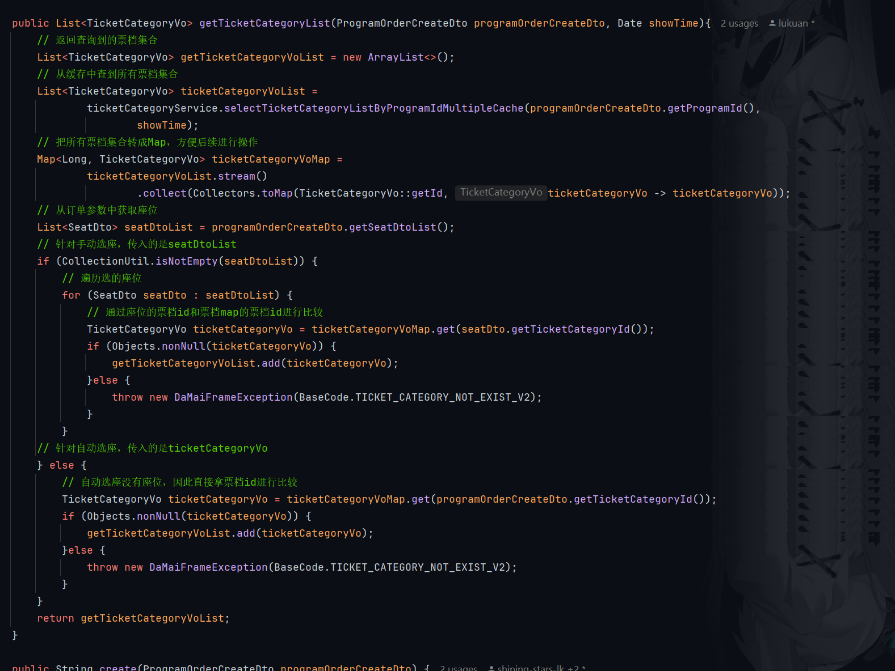

# 大麦项目笔记——业务功能

## 分库分表

关键：选择好**分片键**，减少**全路由**情况

### 一般做法

大部分分库分表就是通过**常用字段**进行分库分表，比如**id**，或者是program库中的seat表通过**强相关的programId**去分表。

### 特殊分片键

#### 1. 附属表

额外维护了user_phone和user_email表，原因：

用户登录的时候用的是手机号或者邮箱，但是如果我们没有额外维护这两张表，则用户进行信息查询的时候会发生全路由。

目前采取的做法是：通过手机号/邮箱查询userId，然后拿着userId去查询userInfo，这样虽然会发生两次查询，但是都不会产生全路由，效率会比直接全路由查询要高

#### 2. 基因法+雪花算法改造

使用基因法对orderId进行改造，原因：

我们希望通过userId和orderId两种方式进行订单查询，但是分片键只能有一个，根据基因法，我们可以对orderId进行改造。

基因法：

```bash
32 = 100000
31 % 32 = 11111(5个1 也就是32取log2次数)
如果把任意一个数x的后五位改造成11111，那么x%32 = 11111
```

因此我们对雪花算法进行改造：


把orderId后面的**序列号**改成是 **userId % 分表数量** 的值。

这样一来，我们进行表查询的时候，只需要拿到**userId/orderId**，然后对**分表数量取模**就行。就能快速定位到表。

进行数据库查询稍微麻烦一点，不能直接使用取模（之前创建orderId是根据表数量来的）。不过也是利用了相同的**基因**，对**分库数	量取模也相同**的性质。进行数据库快速定位

思考：这样的设计会不会产生问题？

原因：**基因替换破坏了原本的序列号**，这个序列号的作用是在时间戳和机器ID相同的情况下作为标识的，会不会导致无法区分orderId

答：是在**本业务中不会有问题**，因为本业务的基因法替换是**创建order**的时候进行的，41位时间戳的长度有精确到了毫秒，因此**冲突	的场景是同一个用户在同一毫秒的时间内创建了多个order**，对于正常的业务而言，这显然是不可能的。

## 业务功能

### 用户服务

#### 1. 预热购票人信息

因为进行购票的时候是高并发，因此即使购票人信息表是通过userId取查询的不会引发全路由也不应该直接查询数据库。应从缓存查询。

查询条件：

1. 时机：抢票首先要进入到节目详情页面，因此可以在**查看节目详情**的时候执行preload逻辑。

2. 用户条件：只有**已登陆**的用户才能进行查询，不登陆无法抢票，无需查询。
3. 节目条件：只有**热门节目**才需要查询，防止内存占用。

思考：会不会有数据库缓存不一致问题？
答：本业务**不会**有数据库缓存不一致问题，因为**查看购票人信息是基于userId**的，也就**没有并发修改**的情况。如果需要修改信息，那么就采取常规做法，先**写数据库再删缓存**即可。

除非出现极端情况，用户同时在不同客户端进行操作。

#### 2. 用户注册缓存穿透

用户注册的时候需要查找用户信息，看当前用户是否已经注册了，如果用户还没注册，这一路查下去就会查到数据库。

场景：比如说我们发布了一个热门演唱会，这时候很多用户是没有注册的，那么高并发注册的时候就会发生缓存穿透。

解决方案：

1. 使用**存缓存**的方式，这样下次查找就能命中缓存了。不可行，因为用户使用的是全新的手机号注册，并且注册一次之后就不会再调用，存储显然是无效的，第一次请求还是会到数据库。

2. 使用**布隆过滤器**，布隆过滤器是对key进行二进制hash，然后判断这个key是否存在

   + 缺点：
     + 判断key存在可能造成误判
     + 数据无法删除
   + 优点：
     + 实现成本较低，速度快
     + 海量数据下判断效率高

   

3. **分布式锁**，减低并发量

   每次只允许一个用户进行注册，放在本业务中显然是**不合理**的，会严重影响用户体验。

本业务采用的是**图形验证码（轻量化流量缓解器）+布隆过滤器**解决缓存穿透问题。

图形验证码的作用：在高并发量的情况下**缓解流量**和**防刷**

布隆过滤器作用：**分散部分请求到缓存**中来，防止数据库压力过大。主要是查询缓存中是否有用户手机号信息，不存在则表示用户还没注册。存在的话，再查**数据库兜底**，看是不是真的存在。


##### 图形验证码校验

1. 首先调用check接口查看是否需要进行校验

   ```java
   @Operation(summary  = "检查是否需要验证码")
   @PostMapping(value = "/check/need")
   public ApiResponse<CheckNeedCaptchaDataVo> checkNeedCaptcha(){
       return ApiResponse.ok(userCaptchaService.checkNeedCaptcha());
   }
   ```

   校验的核心是使用lua脚本看注册接口并发量，如果当前并发量较高，则需要进行图形验证码校验

   ```lua
   local counter_count_key = KEYS[1]
   local counter_timestamp_key = KEYS[2]
   local verify_captcha_id = KEYS[3]
   local verify_captcha_threshold = tonumber(ARGV[1])
   local current_time_millis = tonumber(ARGV[2])
   local verify_captcha_id_expire_time = tonumber(ARGV[3])
   local always_verify_captcha = tonumber(ARGV[4])
   local differenceValue = 1000
   if always_verify_captcha == 1 then
       redis.call('set', verify_captcha_id,'yes')
       redis.call('expire',verify_captcha_id,verify_captcha_id_expire_time)
       return 'true'
   end
   -- 获取当前计数值
   local count = tonumber(redis.call('get', counter_count_key) or "0")
   -- 获取最后一次更新时间
   local lastResetTime = tonumber(redis.call('get', counter_timestamp_key) or "0")
   -- 判断两次请求时间是不是大于1s，如果大于1s，说明请求不频繁，返回false
   if current_time_millis - lastResetTime > differenceValue then
       count = 0
       redis.call('set', counter_count_key, count)
       redis.call('set', counter_timestamp_key, current_time_millis)
   end
   count = count + 1
   -- 判断短时间的请求数是不是大于阈值，大于阈值进行校验返回true
   if count > verify_captcha_threshold then
   -- 重置计数器
       count = 0
       redis.call('set', counter_count_key, count)
       redis.call('set', counter_timestamp_key, current_time_millis)
       redis.call('set', verify_captcha_id,'yes')
       redis.call('expire',verify_captcha_id,verify_captcha_id_expire_time)
       return 'true'
   end
   -- 不大于阈值，那么就更新计数器后返回false
   redis.call('set', counter_count_key, count)
   redis.call('set',verify_captcha_id,'no')
   redis.call('expire',verify_captcha_id,verify_captcha_id_expire_time)
   return 'false'
   ```

2. 如果需要校验，则调用生成图形验证码接口，生成验证码，并通过前端用户传参进行校验

   ```java
   @ApiOperation(value = "获取验证码")
   @PostMapping(value = "/get")
   public ResponseModel getCaptcha(@RequestBody CaptchaVO captchaVO){
       return userCaptchaService.getCaptcha(captchaVO);
   }
   
   // 拼接结束后，传入参数到UserRegisterDto
   @Data
   @ApiModel(value="UserRegisterDto", description ="注册用户")
   public class UserRegisterDto implements Serializable {
   
       // 省略...
       
       @ApiModelProperty(name ="id", dataType ="captchaId", value ="captchaId 调用是否需要校验验证码接口返回")
       @NotBlank
       private String captchaId;
       
       @ApiModelProperty(name ="captchaType", dataType ="String", value ="验证码类型:(clickWord,blockPuzzle)")
       private String captchaType;
       
       @ApiModelProperty(name ="pointJson", dataType ="String", value ="点坐标(base64加密传输)")
       private String pointJson;
       
       @ApiModelProperty(name ="token", dataType ="String", value ="UUID(每次请求的验证码唯一标识)")
       private String token;
       
   }
   ```

3. 进行验证码校验

   ```java
   /**
    * @program: 极度真实还原大麦网高并发实战项目。 添加 阿宽不是程序员 微信，添加时备注 damai 来获取项目的完整资料 
    * @description: 用户注册检查
    * @author: 阿宽不是程序员
    **/
   @Component
   public class UserRegisterVerifyCaptcha extends AbstractUserRegisterCheckHandler {
       
       @Autowired
       private CaptchaHandle captchaHandle;
       
       @Autowired
       private RedisCache redisCache;
       
       /**
        * 验证验证码是否正确
        * */
       @Override
       protected void execute(UserRegisterDto param) {
           //验证密码
           String password = param.getPassword();
           String confirmPassword = param.getConfirmPassword();
           if (!password.equals(confirmPassword)) {
               throw new DaMaiFrameException(BaseCode.TWO_PASSWORDS_DIFFERENT);
           }
           // 从Redis中获取验证码标识 yes or no
           String verifyCaptcha = redisCache.get(RedisKeyBuild.createRedisKey(RedisKeyManage.VERIFY_CAPTCHA_ID,param.getCaptchaId()), String.class);
           // 查不到数据，抛异常
           if (StringUtil.isEmpty(verifyCaptcha)) {
               throw new DaMaiFrameException(BaseCode.VERIFY_CAPTCHA_ID_NOT_EXIST);
           }
           // yes则进入逻辑判断
           if (VerifyCaptcha.YES.getValue().equals(verifyCaptcha)) {
               // 参数不为空校验
               if (StringUtil.isEmpty(param.getCaptchaType())) {
                   throw new DaMaiFrameException(BaseCode.CAPTCHA_TYPE_EMPTY);
               }
               if (StringUtil.isEmpty(param.getPointJson())) {
                   throw new DaMaiFrameException(BaseCode.POINT_JSON_EMPTY);
               }
               if (StringUtil.isEmpty(param.getToken())) {
                   throw new DaMaiFrameException(BaseCode.CAPTCHA_TOKEN_JSON_EMPTY);
               }
               CaptchaVO captchaVO = new CaptchaVO();
               captchaVO.setCaptchaType(param.getCaptchaType());
               captchaVO.setPointJson(param.getPointJson());
               captchaVO.setToken(param.getToken());
               ResponseModel responseModel = captchaHandle.checkCaptcha(captchaVO);
               if (!responseModel.isSuccess()) {
                   throw new DaMaiFrameException(responseModel.getRepCode(),responseModel.getRepMsg());
               }
           }
       }
       
       @Override
       public Integer executeParentOrder() {
           return 0;
       }
       
       @Override
       public Integer executeTier() {
           return 1;
       }
       
       @Override
       public Integer executeOrder() {
           return 1;
       }
   }
   
   /**
    * 校验验证码的有效性并执行二次校验。
    *
    * @param captchaVO 包含验证码相关数据的对象。
    * @return ResponseModel 包含校验结果的响应对象。
   */
   public ResponseModel verification(CaptchaVO captchaVO) {
       // 调用父类的校验逻辑
       ResponseModel r = super.verification(captchaVO);
       // 校验父类方法返回值是否有效
       if (!validatedReq(r)) {
           return r; // 如果父类校验未通过，直接返回结果
       }
       try {
           // 构造缓存键，格式为 REDIS_SECOND_CAPTCHA_KEY + 验证码值
           String codeKey = String.format(REDIS_SECOND_CAPTCHA_KEY, captchaVO.getCaptchaVerification());
           // 检查缓存中是否存在该键，若不存在，返回验证码无效错误
           if (!CaptchaServiceFactory.getCache(cacheType).exists(codeKey)) {
               return ResponseModel.errorMsg(RepCodeEnum.API_CAPTCHA_INVALID);
           }
           // 删除缓存中的验证码键，确保验证码只能被使用一次
           CaptchaServiceFactory.getCache(cacheType).delete(codeKey);
       } catch (Exception e) {
           // 捕获异常并记录日志，返回错误消息
           logger.error("验证码坐标解析失败", e);
           return ResponseModel.errorMsg(e.getMessage());
       }
       // 校验通过，返回成功响应
       return ResponseModel.success();
   }
   ```

##### 用户注册逻辑校验

```java
@Component
public class UserRegisterCountCheckHandler extends AbstractUserRegisterCheckHandler {
    
    @Autowired
    private RequestCounter requestCounter;
    
    // 本地计数验证每秒用户注册请求是否超过最大限制
    @Override
    protected void execute(final UserRegisterDto param) {
        boolean result = requestCounter.onRequest();
        if (result) {
            throw new DaMaiFrameException(BaseCode.USER_REGISTER_FREQUENCY);
        }
    }
    
    @Override
    public Integer executeParentOrder() {
        return 1;
    }
    
    @Override
    public Integer executeTier() {
        return 2;
    }
    
    @Override
    public Integer executeOrder() {
        return 1;
    }
}

/**
 * 本地计数，如果达到了阈值就抛出异常
 * @return
 */
public synchronized boolean onRequest() {
    long currentTime = System.currentTimeMillis();
    long differenceValue = 1000;
    // 间隔较大，清空count
    if (currentTime - lastResetTime.get() >= differenceValue) {
        count.set(0);
        lastResetTime.set(currentTime);
    }
	// 超过最大并发数，进行限制
    if (count.incrementAndGet() > maxRequestsPerSecond) {
        log.warn("请求超过每秒{}次限制",maxRequestsPerSecond);
        count.set(0);
        lastResetTime.set(System.currentTimeMillis());
        return true;
    }
    return false;
}
```

##### 检测用户是否已注册

```java
@Component
public class UserExistCheckHandler extends AbstractUserRegisterCheckHandler {

    @Autowired
    private UserService userService;

    /**
     * 验证是否已注册用户
     * */
    @Override
    public void execute(final UserRegisterDto userRegisterDto) {
        userService.doExist(userRegisterDto.getMobile());
    }
    
    @Override
    public Integer executeParentOrder() {
        return 1;
    }
    
    @Override
    public Integer executeTier() {
        return 2;
    }

    @Override
    public Integer executeOrder() {
        return 2;
    }
}

public void doExist(String mobile){
    // 使用布隆过滤器判断
    boolean contains = bloomFilterHandler.contains(mobile);
    // 布隆过滤器返回存在，查数据库兜底
    if (contains) {
        LambdaQueryWrapper<UserMobile> queryWrapper = Wrappers.lambdaQuery(UserMobile.class)
                .eq(UserMobile::getMobile, mobile);
        UserMobile userMobile = userMobileMapper.selectOne(queryWrapper);
        if (Objects.nonNull(userMobile)) {
            throw new DaMaiFrameException(BaseCode.USER_EXIST);
        }
    }
}
```

#### 3. 用户登录、退出

登录：主要就是通过userMobile或者email进行检查，然后通过userMobile/email查询userId，再通过userId查询userInfo。期间还进行了非空检查，1分钟内的错误次数检查。最后返回loginUserVo，包含token等信息，后续请求带着token就可以解析出userId，进而从redis中拿到userInfo

退出：根据传入的Dto判断user是不是真的存在，如果存在的话，从redis中删除对应code（平台code）的userInfo

#### 4. 用户信息脱敏展示

一共是一下四种方案：

1. 自定义注解，在需要用到的字段上加上注解
2. AOP，对返回进行处理，比如加上@AfterReturning进行拦截返回值，进行特殊处理
3. 自定义序列化器，自定义一个Jaskson序列化器，然后注册
4. 使用Hibernate Validtor

各自缺点：

1. **自定义注解和AOP**对于脱敏而言，都比较笨重，且依赖于Spring环境，还要考虑到抽取组件
2. **自定义序列号**，得考虑到项目中json序列化有没有定制，jackson有没有替换掉
3. **Hibernate Validtor**，使用场景有限，不是所有实体都要Hibernate Validtor

实现的方案：

我们的实体VO使用了@Data注解，不需要手动写getter/setter方法，json的转化都需要getter/setter方法，因此可以考虑改造getter方法，可以使用自定义getter方法+hutool工具类实现

```java
@Data
@ApiModel(value="TicketUserVo", description ="购票人数据")
public class TicketUserVo implements Serializable {

    private static final long serialVersionUID = 1L;
    
    @ApiModelProperty(name ="relName", dataType ="String", value ="用户真实名字")
    private String relName;
    
    public String getRelName() {
        if (StringUtil.isNotEmpty(relName)) {
            // 这里使用 hutool 的 hide 方法
            return StrUtil.hide(relName, 0, 1);
        }
        return relName;
    }
}

/**
 * 替换指定字符串的指定区间内字符为"*"
 * 俗称：脱敏功能，后面其他功能，可以见：DesensitizedUtil(脱敏工具类)
 *
 * 
<pre>
 * CharSequenceUtil.hide(null,*,*)=null
 * CharSequenceUtil.hide("",0,*)=""
 * CharSequenceUtil.hide("jackduan@163.com",-1,4)   ****duan@163.com
 * CharSequenceUtil.hide("jackduan@163.com",2,3)    ja*kduan@163.com
 * CharSequenceUtil.hide("jackduan@163.com",3,2)    jackduan@163.com
 * CharSequenceUtil.hide("jackduan@163.com",16,16)  jackduan@163.com
 * CharSequenceUtil.hide("jackduan@163.com",16,17)  jackduan@163.com
 * </pre>
 *
 * @param str          字符串
 * @param startInclude 开始位置（包含）
 * @param endExclude   结束位置（不包含）
 * @return 替换后的字符串
 * @since 4.1.14
 */
public static String hide(CharSequence str, int startInclude, int endExclude) {
    return replace(str, startInclude, endExclude, '*');
}
```

#### 5. 用户信息脱敏存储

主要是通过配置ShadingSphere进行加密，配置需要加密的数据库表和列，以及加密算法，即可在存储的时候自动加密，同时使用对称加密算法，使得取出数据的时候也可以自动进行解密

### 节目服务

#### 1. 初始化数据


本过程应该是由运营人员考虑，为了学习，我们在项目初始化的时候加载数据，以供使用。

我们自定义了四种init组件，在节目服务的初始化中用到的是PostContruct组件进行初始化，比如ProgramElasticsearchInitData，此外，初始化有异步和同步两种方式，对于向ES加载数据、获取节目分类，我们采用异步线程进行，防止拖慢项目启动速度。像更新节目时间，缓存布隆过滤器中的节目数据，我们采用的是同步的做法

```java
// ProgramElasticsearchInitData

@Override
    public void executeInit(final ConfigurableApplicationContext context) {
        BusinessThreadPool.execute(() -> {
            try {
                initElasticsearchData();
            }catch (Exception e) {
                log.error("executeInit error",e);
            }
        });
    }
```

#### 2. 加载主页数据

主页样式：


主页样式主要是通过parentProgramCategoryIds进行查询的（主页都是大的分类），所以如果想直接在数据库中查询会引发全路由（除非是建立附属表）。

但是本项目除了可以在数据库中查，为了检索方便，引入了ElasticSearch，在初始化数据的时候已经把数据放到ES中了，因此这里可以直接查ES拿到主页的节目数据，然后再用数据库兜底（全路由）

通过ES查询的思路：

1. 对父节目循环查询子节目
2. 拼接地区条件、父节目类型条件
3. 查询前7条节目数据
4. 拼接节目数据到Vo中

#### 3. 分页查询节目数据

分页查询页面：


分页查询节目数据Dto传参较多，会引起全路由，因此分页查询节目数据也是采用ES进行数据查询+数据库兜底的策略，通过设置城市、父类型、子类型、时间、排序顺序来进行ES查询

#### 4. 查看节目详情


查看节目详情需要从多个表中查询，最后组装成Vo。

##### 1. detail版本

此版本API就是正常执行从redis中获取，查不到的话就查数据库，然后把数据写回redis

**问题：**

如果缓存中没有数据，那所有的请求都要打到数据库上，存在着缓存击穿的问题。因此后续更新API以优化缓存击穿问题。因此需要对逻辑进行优化。

##### 2. detailV1版本

**lock()版本：**

模仿解决单例模式的懒惰初始化的解决安全问题的方式，在尝试查数据库的时候进行加锁，获取锁成功之后再次尝试从redis获取数据，这种方式使得只有第一个获取到锁的线程会去查数据库，后续的线程都是从redis中查到数据。

**问题：**

虽然后续的请求不需要再查数据库了，但是还是要执行**加锁-查redis-解锁**的逻辑，如果并发量高的话，就会很耗时，因此需要降低获取锁的竞争程度。

**tryLock()版本：**

**解决：**

把lock()改成是tryLock()，等待时间是1s，也就是后续请求如果超过1s获取不到锁，就不再获取了，此时第一个线程已经把数据写到redis了，直接查redis就能拿到。

**思考：**

如果第一个线程的运行时间超过了1s，那么后续的请求都会打到数据库，也会造成击穿，因此为了高可用可以测试最低阈值，在阻塞业务时间和高可用性之间做平衡。

##### 3. detailV2版本

**思考：**

所有的请求都由redis处理，怎么保证**redis的可用性**呢？

**redis集群的局限性：**

redis集群虽然可以保证高可用，但是针对的场景是**请求多个不同对象**，比如100万个并发请求，查询100个节目，此时使用集群确实可以缓解压力。

但是我们现在的业务是高并发查看同一个节目的详细信息。因为请求还是会打到同一个节点。

**本地缓存：**

**优势：**

+ 本地缓存的**速度**是redis的几十倍以上
+ 使用本地缓存没有**网络消耗**

**思考：**

1. 如何**设计**本地缓存？
2. 如何进行多级缓存的**管理**？
3. 怎么保证多级缓存的**一致性**？
4. 本地缓存怎么考虑过期时间防止**内存溢出**？

**选型：**

考虑本地缓存，使用的结构应该是Map

+ HashMap线程不安全，排除。
+ ConcurrentHashMap，线程安全，但是必须显示移除历史缓存
+ **Caffeine线程安全，并可以通过配置自动移除不常用数据**

综上，选择Caffeine作为本地缓存

**实现：**

优先从本地缓存中获取，如果获取不到就到redis中查询

```java
// 查询多级缓存方法
public ProgramShowTime selectProgramShowTimeByProgramIdMultipleCache(Long programId){
    return localCacheProgramShowTime.getCache(RedisKeyBuild.createRedisKey
            (RedisKeyManage.PROGRAM_SHOW_TIME, programId).getRelKey(),
            key -> selectProgramShowTimeByProgramId(programId));
}
// getCache方法
public ProgramShowTime getCache(String id, Function<String, ProgramShowTime> function){
        return localCache.get(id,function);
}
```

自定义本地缓存：

```java
@Component
public class LocalCacheTicketCategory {
    
    /**
     * 本地缓存
     * */
    private Cache<Long, List<TicketCategoryVo>> localCache;
    
    /**
     * 本地缓存的容量
     * */
    @Value("${maximumSize:10000}")
    private Long maximumSize;
    
    @Autowired
    private RedisCache redisCache;
    
    @PostConstruct
    public void localLockCacheInit(){
        localCache = Caffeine.newBuilder()
                .maximumSize(maximumSize)
                .expireAfter(new Expiry<Long, List<TicketCategoryVo>>() {
                    @Override
                    public long expireAfterCreate(@NonNull final Long key, 
                                                  @NonNull final List<TicketCategoryVo> value,
                                                  final long currentTime) {
                        Long expire = redisCache.getExpire(RedisKeyBuild.createRedisKey
                                (RedisKeyManage.PROGRAM_TICKET_CATEGORY_LIST, key),TimeUnit.MILLISECONDS);
                        return TimeUnit.MILLISECONDS.toNanos(expire);
                    }
                    
                    @Override
                    public long expireAfterUpdate(@NonNull final Long key, 
                                                  @NonNull final List<TicketCategoryVo> value,
                                                  final long currentTime, 
                                                  @NonNegative final long currentDuration) {
                        return currentDuration;
                    }
                    
                    @Override
                    public long expireAfterRead(@NonNull final Long key, 
                                                @NonNull final List<TicketCategoryVo> value,
                                                final long currentTime, 
                                                @NonNegative final long currentDuration) {
                        return currentDuration;
                    }
                })
                .build();
    }
    
    /**
     * Caffeine的get是线程安全的
     * */
    public List<TicketCategoryVo> getCache(Long id, 
                                           Function<Long, List<TicketCategoryVo>> function){
        return localCache.get(id,function);
    }
    
    public void del(Long id){
        localCache.invalidate(id);
    }
}
```

部分数据过期时间不能直接拿到，就从redis获取，比如票档数据没有节目演出时间，这时候可以从redis中查这个过期时间

**多级缓存的一致性：**

对于一致性，通用的方案就是**修改数据库之后删除缓存**。

**但是本地缓存在每个实例上都进行了存储，要怎么去更新呢？**

**解决方案：**

1. 定时任务查询：定时从库中扫描失效的数据，对于已经失效的数据就在缓存中删除。频率不要确定，高了影响性能，低了清除不掉，且对于多个实例而言，这样的性能损耗比较大
2. 使用消息中间件：考虑其实没必要为了一个请求本地缓存的业务去实现MQ，能不能简化使用消息通知
3. Redis的PUB/SUB：致命问题是没法进行持久化，如果出现异常消息会丢失
4. Redis的Stream：是Redis对消息队列的完善，可以考虑使用Stream

考虑使用Stream，原因如下：

1. 相比MQ而言更加轻量级，清除缓存的操作不需要MQ这种专门解决高并发问题的中间件
2. 每个实例都连接了Redis，通信方便，不需要引入额外的中间件
3. 可以进行数据持久化

**实现：**

通过封装的API进行stream广播，使得每一个实例消费即可

#### 5. 用户选座

存储结构：


采用的是hash结构，方便后续下单和取消订单的时候进行座位状态变更

选座是在节目详细页面的，因此入参只有programId

查询流程：

1. 要先根据programId查到节目的详细信息

2. 根据programId查询演出时间
3. 根据演出时间和节目id查询节目票档
4. 根据票档和节目id查询座位信息
5. 按照节目价格进行分组（用户选择价格，前端需要给对应价格的座位高亮显示）
6. 填充数据，返回vo

#### 6. 用户下单

##### 用户下单流程图


##### 下单前置校验

通过组合容器进行构建下单校验逻辑

.png)

在购票前进行三次校验,分别是参数校验，每笔订单最多购票数量校验和每个用户最多购票数量校验

##### 购票流程V1

1. 加锁

   ```java
   @RepeatExecuteLimit(
               name = RepeatExecuteLimitConstants.CREATE_PROGRAM_ORDER,
               keys = {"#programOrderCreateDto.userId","#programOrderCreateDto.programId"})
       @ServiceLock(name = PROGRAM_ORDER_CREATE_V1,keys = {"#programOrderCreateDto.programId"})
       @Override
       public String createOrder(final ProgramOrderCreateDto programOrderCreateDto) {
           // 组合模式进行校验
           compositeContainer.execute(CompositeCheckType.PROGRAM_ORDER_CREATE_CHECK.getValue(),programOrderCreateDto);
           // 传播订单
           return programOrderService.create(programOrderCreateDto);
       }
   ```

   首先使用PROGRAM_ORDER_CREATE_V1加锁，保证数据一致性

2. 幂等操作

   @RepeatExecuteLimit即对业务进行幂等速率限制，分布式锁的作用是防止不同的用户同时对参数进行修改，而幂等操作是防止同一个用户短时间内操作多次业务

3. 分布式锁

   @ServiceLock指定锁的种类，然后尝试获取分布式锁，保证同一时间内只有一个用户下单

4. 前置校验

   通过组合校验模式进行前置校验，校验通过才继续执行

5. 执行业务逻辑

   1. 获取节目演出时间

      直接从缓存中获取即可

   2. 获取节目票档类型

      主要是从传入参数中获取座位的票档id/票档id，和真正的票档id进行比较，然后返回票档类型的vo集合。

      这里返回集合的原因是方式手动选座选了多张不同票档的座位

      

   3. 构建参数，再次进行参数校验

      构建要扣减的座位

      + 手动选座

        校验每个票档的余票数量，构建订单参数，校验总价格

      + 自动选座

        自动选座一笔订单只能选一种座位，因此只进行余票数量校验，并通过算法检索座位和构建要购买的座位Dto

   4. 更新缓存数据

      通过传入订单状态（未支付，已取消）来选择扣减/增加座位余数，进行状态迁移，把座位从未锁定->锁定/锁定->未锁定，通过lua脚本执行，保证原子性

   5. 创建订单

      1. 构建订单参数

         构建主订单参数和购票人订单参数

      2. 通过RPC创建订单

      3. 加入订单到延迟队列，超时则取消

##### 购票流程V2

**不同版本之间主要是加锁流程的区别，业务流程一样**

问题：

V1版本的问题：V1的加锁粒度是programId，这样就会导致缓存分片(programId+catagoryId)失效，因此需要进行锁粒度的细化，变成和分片一样的粒度

Redis压力问题：V1版本中是直接到Redis中去获取分布式锁，这样一瞬间所有请求都会打到Redis，会造成Redis压力过大。

V2使用本地缓存Caffeine进行本地锁，只有获取到本地锁的请求才能到Redis中获取锁。

本地锁+分布式锁流程示意：


加锁流程：

```java
@RepeatExecuteLimit(
            name = RepeatExecuteLimitConstants.CREATE_PROGRAM_ORDER,
            keys = {"#programOrderCreateDto.userId","#programOrderCreateDto.programId"})
    @Override
    public String createOrder(ProgramOrderCreateDto programOrderCreateDto) {
        compositeContainer.execute(CompositeCheckType.PROGRAM_ORDER_CREATE_CHECK.getValue(),programOrderCreateDto);
        List<SeatDto> seatDtoList = programOrderCreateDto.getSeatDtoList();
        List<Long> ticketCategoryIdList = new ArrayList<>();
        // 获取票档集合
        if (CollectionUtil.isNotEmpty(seatDtoList)) {
            ticketCategoryIdList =
                    seatDtoList.stream().map(SeatDto::getTicketCategoryId).distinct().collect(Collectors.toList());
        }else {
            ticketCategoryIdList.add(programOrderCreateDto.getTicketCategoryId());
        }
        // 本地锁集合
        List<ReentrantLock> localLockList = new ArrayList<>(ticketCategoryIdList.size());
        // 分布式锁集合
        List<RLock> serviceLockList = new ArrayList<>(ticketCategoryIdList.size());
        // 获取成功的本地锁集合
        List<ReentrantLock> localLockSuccessList = new ArrayList<>(ticketCategoryIdList.size());
        // 获取成功的分布式锁集合
        List<RLock> serviceLockSuccessList = new ArrayList<>(ticketCategoryIdList.size());
        // 获取锁集合
        for (Long ticketCategoryId : ticketCategoryIdList) {
            String lockKey = StrUtil.join("-",PROGRAM_ORDER_CREATE_V2,
                    programOrderCreateDto.getProgramId(),ticketCategoryId);
            ReentrantLock localLock = localLockCache.getLock(lockKey,false);
            RLock serviceLock = serviceLockTool.getLock(LockType.Reentrant, lockKey);
            localLockList.add(localLock);
            serviceLockList.add(serviceLock);
        }
        // 先逐个获取本地锁
        for (ReentrantLock reentrantLock : localLockList) {
            try {
                reentrantLock.lock();
            }catch (Throwable t) {
                break;
            }
            localLockSuccessList.add(reentrantLock);
        }
        // 逐个获取分布式锁
        for (RLock rLock : serviceLockList) {
            try {
                rLock.lock();
            }catch (Throwable t) {
                break;
            }
            serviceLockSuccessList.add(rLock);
        }
        try {
            return programOrderService.create(programOrderCreateDto);
        }finally {
            // 释放分布式锁，倒序
            for (int i = serviceLockSuccessList.size() - 1; i >= 0; i--) {
                RLock rLock = serviceLockSuccessList.get(i);
                try {
                    rLock.unlock();
                }catch (Throwable t) {
                    log.error("service lock unlock error",t);
                }
            }
            // 释放本地锁，倒序
            for (int i = localLockSuccessList.size() - 1; i >= 0; i--) {
                ReentrantLock reentrantLock = localLockSuccessList.get(i);
                try {
                    reentrantLock.unlock();
                }catch (Throwable t) {
                    log.error("local lock unlock error",t);
                }
            }
        }
    }
```

**注意：**

- 本地锁是借助ReentrantLock实现的，因此可以选择公平和非公平方式，但是获取分布式锁的过程就无法保证公平性了，因为是网络传输。
- 释放锁的逻辑应该和获取锁相反，最后获取的最先释放，这样才能保证不发生死锁


