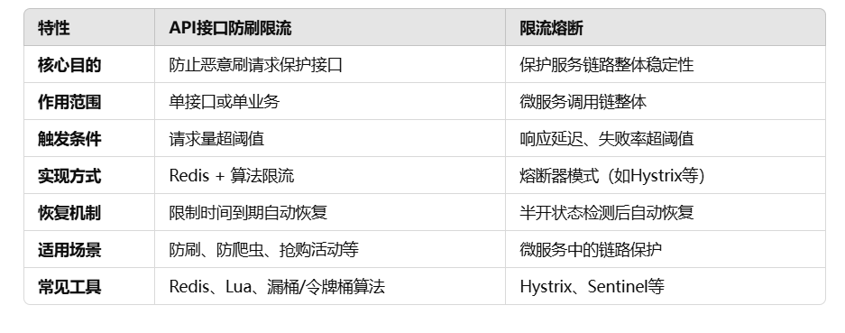

# 大麦项目笔记——组件架构

## 参数加密和签名

在网关模块中，为了保证后端系统安全性，会对前端请求进行签名认证。

格式：

1. 同一采用POST请求，因为需要搭载属性
2. 如果不跳过验证，则body中一定要有以下字段
   1. code：平台码，不同的平台标识，用于让后端区分加解密算法
   2. businsessBody：业务参数
   3. sin：签名

通过请求头`no_verify = true`、`encrypt = v1/v2`关闭/开启参数校验

### V1版本

V1版本采用的是把**code和businessBody结合进行签名，签名放到sign中**。验签的时候，通过code查找对应的公钥，然后进行校验。

### V2版本

V2版本相比V1多了一层加密，也就是前端传给后端参数的业务参数也进行加密了，sign的加密不变。

也就是后端在进行签名校验之前得到的**businessBody参数也是密文**，需要先对business进行解密，然后拿到明文business才能对sign进行验签


## 链路追踪

市场上常用的链路追踪工具是SkyWalking，研究了一下，他是通过字节码增强生成代理类，然后本地内存进行数据汇总，接着使用gRPC传输到控制台中。

项目中的链路不会特别长，最多也就是4层，于是我决定自己搭建一个简单的链路追踪方案。

主要考虑的方向：

1. 唯一性：链路Id一定是唯一的，应该通过UUID或者结合时间戳等方式进行生成
2. 传播机制：链路Id需要随着请求一起传递，通常是通过头部实现，通过AOP每次从请求中读取，处理完毕后再加入到下游服务请求的头部中
3. 轻量级：不希望对性能损耗太大
4. 可以实现监控收集和展示：可视化界面更加直观，不需要到处找

### 实现方案

在（Nginx/Gateway）中生traceId，然后在后续的请求中传递，同时利用AOP把traceId提前放到MDC中，这样每次执行请求的时候就能打印traceId了

### 问题1：Feign的传递

默认的Feign不会把A服务的请求头中的内容添加到B服务的请求头中，但是这个相对好解决，只需要通过在为spring-cloud-frameword的component中继承`RequestInterceptor`进行改造即可，然后再通过自动装配引入到feign的调用模块，Spring在使用feign调用的时候就遍历所有注册的RequestInterceptor，然后执行自定义方法了。

### 问题2：线程池调用

我们使用的MDC和BaseParameterHolder本质上都是ThreadLocal，也就是作用域只在本线程，那么父子线程之间的传递就是得考虑的地方（比如异步预热用户购票人信息）

1. 单纯传递RequestAttributes的弊端：如果开启了异步线程，且子线程运行比较耗时，这时候如果父线程已经结束运行了，则拿不到RequestAttributes

2. 考虑阿里的TransmittableThreadLocal可以解决问题，但是会比较重，因为我们只有个别参数需要传递，因此可以考虑自己对核心部分进行改造

   通过wrapTask进行改造，取得父线程的上下文信息，然后放到子进程中，再利用finally还原子线程的上下文信息

   

   

## 统一服务初始化操作

为了统一服务初始化，首先需要了解SpringBean初始化顺序

### SpringBean初始化接口

```java
// 1.InitializingBean的afterPropertiesSet执行
@Component
public class TestInitializingBean implements InitializingBean {
    
    @Override
    public void afterPropertiesSet() {
        System.out.println("======afterPropertiesSet执行======");
    }
}


// 2.postConstruct执行
@Component
public class TestPostConstruct {
    
    @PostConstruct
    public void postConstruct(){
        System.out.println("======postConstruct执行======");
    }
}

// 3.ApplicationEventListener执行
@Component
public class TestEventListener implements ApplicationListener<ApplicationStartedEvent> {
    
    @Override
    public void onApplicationEvent(ApplicationStartedEvent event) {
        System.out.println("======ApplicationStartedEvent执行======");
    }
}

// 4.CommandLineRunner使用run执行
@Component
public class TestCommandLineRunner implements CommandLineRunner {
    
    @Override
    public void run(final String... args) {
        System.out.println("======run执行======");
    }
}

// 先后顺序:
// ======afterPropertiesSet执行======
// ======postConstruct执行======
// ======ApplicationStartedEvent执行======
// ======run执行======

// 简单理解就是先inizialingBean的afterPropertiesSet，然后PostConstruct，然后ApplicationStartedEvent，最后才是run接口
```

### 自定义Bean初始化顺序

当然，我们可以通过@Order注解执行Bean初始化顺序，但是一旦自定义的组件多了之后，Order不便于维护，于是可以考虑自定义初始化，这样能够明确我们某个组件用的是什么方式初始化，在这个方式的初始化过程中的顺序是怎么样的

初始化组件结构：


`InitializeHandler`初始化顶级接口，定义了type，excutorOrder，executeInit三个接口，其中type通过四种初始化抽象类指定，具体的执行顺序和执行逻辑由具体实现类实现

```java
public interface InitializeHandler {
    /**
     * 初始化执行 类型
     * @return 类型
     * */
    String type();
    
    /**
     * 执行顺序
     * @return 顺序
     * */
    Integer executeOrder();
    
    /**
     * 执行逻辑
     * @param context 容器上下文
     * */
    void executeInit(ConfigurableApplicationContext context);
    
}
```

具体初始化还是借助Spring容器的初始化手段，通过excute包下定义的方法实现的，比如下面是Initialing Bean实现类

```java
public class ApplicationInitializingBeanExecute extends AbstractApplicationExecute implements InitializingBean {
    
    public ApplicationInitializingBeanExecute(ConfigurableApplicationContext applicationContext){
        super(applicationContext);
    }
    
    @Override
    public void afterPropertiesSet() {
        execute();
    }
    
    @Override
    public String type() {
        return APPLICATION_INITIALIZING_BEAN;
    }
}

@AllArgsConstructor
public abstract class AbstractApplicationExecute {
    
    private final ConfigurableApplicationContext applicationContext;
    
    public void execute(){
        Map<String, InitializeHandler> initializeHandlerMap = applicationContext.getBeansOfType(InitializeHandler.class);
        initializeHandlerMap.values()
                .stream()
                .filter(initializeHandler -> initializeHandler.type().equals(type()))
                .sorted(Comparator.comparingInt(InitializeHandler::executeOrder))
                .forEach(initializeHandler -> {
                    initializeHandler.executeInit(applicationContext);
                });
    }
    /**
     * 初始化执行 类型
     * @return 类型
     * */
    public abstract String type();
}
```

借助Spring进行初始化，但是具体细节我们通过applicationContext获取到Bean的方法实现，然后执行初始化类型比较和排序，最后执行初始化方法。

实现之后，Bean的初始化顺序会很方便进行跟踪，只要看实现类继承了对应四种抽象类，实现的接口排序顺序是什么样的，初始化是进行什么操作可以一目了然。

## 组合模式解决参数校验

### 组合容器初始化

初始化类，继承了监听应用启动的组件，也就是**在服务初始化的时候会进行初始化，后续需要使用的时候直接就可以用了**

```java
// 执行组合容器初始化工作
@AllArgsConstructor
public class CompositeInit extends AbstractApplicationStartEventListenerHandler {

    /**
     * 组合容器
     */
    private final CompositeContainer compositeContainer;
    
    @Override
    public Integer executeOrder() {
        return 1;
    }

    /**
     * 进行组合容器初始化
     * @param context 容器上下文
     */
    @Override
    public void executeInit(ConfigurableApplicationContext context) {
        compositeContainer.init(context);
    }
}
```

**具体初始化过程：**

首先执行随着应用启动和CompositeInit调用CompositeContainer的init()方法，进行初始化

1. 加载AbstractComposite的Bean
2. 然后根据type分组
3. 接着调用build()构建树结构
4. 最后返回`Map<type,CompositeTree>`结构的树

```java
public class CompositeContainer<T> {
    
    private final Map<String, AbstractComposite> allCompositeInterfaceMap = new HashMap<>();

    /**
     * 初始化构建树结构
     * */
    public void init(ConfigurableApplicationContext applicationEvent){
        // 获取所有 AbstractComposite 类型的 Bean
        Map<String, AbstractComposite> compositeInterfaceMap = applicationEvent.getBeansOfType(AbstractComposite.class);
        // 查找出AbstractComposite类型，然后根据type进行分组
        Map<String, List<AbstractComposite>> collect = compositeInterfaceMap.values().stream().collect(Collectors.groupingBy(AbstractComposite::type));
        collect.forEach((k,v) -> {
            // 构建组件树结构
            AbstractComposite root = build(v);
            // 如果根节点存在，则执行业务逻辑
            if (Objects.nonNull(root)) {
                allCompositeInterfaceMap.put(k, root);
            }
        });
    }

    /**
     * 执行树中的节点
     * */
    public void execute(String type,T param){
        AbstractComposite compositeInterface = Optional.ofNullable(allCompositeInterfaceMap.get(type))
                .orElseThrow(() -> new DaMaiFrameException(BaseCode.COMPOSITE_NOT_EXIST));
        compositeInterface.allExecute(param);
    }    
    
    
    /**
     * 构建组件树的辅助方法。
     * @param groupedByTier 按层级组织的组件映射。
     * @param currentTier 当前处理的层级。
     */
    private static void buildTree(Map<Integer, Map<Integer, AbstractComposite>> groupedByTier, int currentTier) {
        Map<Integer, AbstractComposite> currentLevelComponents = groupedByTier.get(currentTier);
        Map<Integer, AbstractComposite> nextLevelComponents = groupedByTier.get(currentTier + 1);
        
        if (currentLevelComponents == null) {
            // 当前层级没有组件时，直接返回
            return;
        }
        
        if (nextLevelComponents != null) {
            for (AbstractComposite child : nextLevelComponents.values()) {
                Integer parentOrder = child.executeParentOrder();
                if (parentOrder == null || parentOrder == 0) {
                    // 跳过根节点
                    continue;
                }
                AbstractComposite parent = currentLevelComponents.get(parentOrder);
                if (parent != null) {
                    // 将子节点添加到父节点的子列表中
                    parent.add(child);
                }
            }
        }
        
        // 递归构建下一层级的树结构
        buildTree(groupedByTier, currentTier + 1);
    }
    
    /**
     * 根据提供的组件集合构建组件树，并返回根节点。
     * @param components 组件集合。
     * @return 根节点。
     */
    private static AbstractComposite build(Collection<AbstractComposite> components) {
        // 按层级和执行顺序组织组件
        Map<Integer, Map<Integer, AbstractComposite>> groupedByTier = new TreeMap<>();
        
        for (AbstractComposite component : components) {
            groupedByTier.computeIfAbsent(component.executeTier(), k -> new HashMap<>(16))
                    // 使用 executeOrder 作为键
                    .put(component.executeOrder(), component);
        }
        
        // 找到最小层级
        Integer minTier = groupedByTier.keySet().stream().min(Integer::compare).orElse(null);
        if (minTier == null) {
            // 没有组件时返回空
            return null;
        }
        
        // 构建组件树
        buildTree(groupedByTier, minTier);
        
        // 找到并返回根节点
        return groupedByTier.get(minTier).values().stream()
                .filter(c -> c.executeParentOrder() == null || c.executeParentOrder() == 0)
                .findFirst()
                .orElse(null);
    }
}
```

树结构：


### 组合容器使用

用户注册参数校验组合树：


类结构：


比如说我现在的用户注册需要进行三种参数校验

1. 图形验证码校验
2. 当前短期注册并发量校验（如果现在系统压力过大就不予注册）
3. 用户是否已经注册校验

```java
public abstract class AbstractUserRegisterCheckHandler extends AbstractComposite<UserRegisterDto> {
    
    @Override
    public String type() {
        return CompositeCheckType.USER_REGISTER_CHECK.getValue();
    }
}
```

那就先创建一个`AbstractUserRegisterCheckHandler`继承`AbstractComposite<UserRegisterDto>`，规定类型，然后再用三个具体的`参数校验Handler`继承`AbstractUserRegisterCheckHandler`，定义具体的excute方法和树结构的顺序

以`UserExistCheckHandler`为例：

```java
@Component
public class UserExistCheckHandler extends AbstractUserRegisterCheckHandler {

    @Autowired
    private UserService userService;
    
    @Override
    public void execute(final UserRegisterDto userRegisterDto) {
        userService.doExist(userRegisterDto.getMobile());
    }
    
    @Override
    public Integer executeParentOrder() {
        return 1;
    }
    
    @Override
    public Integer executeTier() {
        return 2;
    }

    @Override
    public Integer executeOrder() {
        return 2;
    }
}
```

### 组合容器执行校验

实际上执行就是使用了二叉树层序遍历进行执行校验

```java
    /**
     * 按层次结构执行每个组件的业务逻辑
     * @param param 泛型参数，用于业务执行
     */
    public void allExecute(T param) {
        Queue<AbstractComposite<T>> queue = new LinkedList<>();
        
        queue.add(this); 
        
        while (!queue.isEmpty()) {
           
            int levelSize = queue.size(); 
            
            for (int i = 0; i < levelSize; i++) {
               
                AbstractComposite<T> current = queue.poll(); 
                
                
                assert current != null;
                current.execute(param);
                
                queue.addAll(current.list);
            }
        }
    }
```

## 图形验证码


## RedisStream封装

### 序列化

redisTemplate依赖于comment模块

### 配置信息

通过application.yaml文件即可指定配置信息

```java
@Data
@ConfigurationProperties(prefix = RedisStreamConfigProperties.PREFIX)
public class RedisStreamConfigProperties {
    
    // 配置前缀，用于读取yaml文件
    public static final String PREFIX = "spring.data.redis.stream";
    
    /**
     * stream名字
     * */
    private String streamName;
    
    /**
     * 消费组名字
     * */
    private String consumerGroup;
    
    /**
     * 消费者名
     * */
    private String consumerName;
    
    /**
     * 消费方式 group:消费组(默认)/broadcast:广播
     */
    private String consumerType = RedisStreamConstant.GROUP;
}
```

### 自动装配信息

通过自动装配相关API，使得其他模块便于使用

```java
@Slf4j
@EnableConfigurationProperties(RedisStreamConfigProperties.class)
public class RedisStreamAutoConfig {
    
    /**
     * 消息发送配置
     * */
    @Bean
    public RedisStreamPushHandler redisStreamPushHandler(StringRedisTemplate stringRedisTemplate, 
                                                         RedisStreamConfigProperties redisStreamConfigProperties) {
        return new RedisStreamPushHandler(stringRedisTemplate, redisStreamConfigProperties);
    }
    
    /**
     * 消息操作配置
     * */
    @Bean
    public RedisStreamHandler redisStreamHandler(RedisStreamPushHandler redisStreamPushHandler, 
                                                 StringRedisTemplate stringRedisTemplate) {
        return new RedisStreamHandler(redisStreamPushHandler, stringRedisTemplate);
    }
    
    /**
     * 主要做的是将OrderStreamListener监听绑定消费者，用于接收消息
     *
     * @param redisConnectionFactory redis连接工厂
     * @return StreamMessageListenerContainer
     */
    @Bean
    @ConditionalOnBean(MessageConsumer.class)
    public StreamMessageListenerContainer<String, ObjectRecord<String, String>> streamMessageListenerContainer(
            RedisConnectionFactory redisConnectionFactory, 
            RedisStreamConfigProperties redisStreamConfigProperties, 
            RedisStreamHandler redisStreamHandler, 
            MessageConsumer messageConsumer) {
        //消息侦听容器，创建后，StreamMessageListenerContainer可以订阅Redis流并使用传入的消息
        StreamMessageListenerContainer.StreamMessageListenerContainerOptions<String, ObjectRecord<String, String>> 
                options = StreamMessageListenerContainer.StreamMessageListenerContainerOptions.builder()
                    //拉取消息超时时间
                    .pollTimeout(Duration.ofSeconds(5))
                    //批量抓取消息的数量
                    .batchSize(10)
                    //传递的数据类型
                    .targetType(String.class)
                    //获取消息的过程或获取到消息给具体的消息者处理的过程中，发生了异常的处理
                    .errorHandler(t -> log.error("出现异常", t))
                    //执行拉取任务的执行线程池
                    .executor(createThreadPool()).build();
        StreamMessageListenerContainer<String, ObjectRecord<String, String>> container = 
                StreamMessageListenerContainer.create(redisConnectionFactory, options);
        //检查消费类型，消费组或者广播
        checkConsumerType(redisStreamConfigProperties.getConsumerType());
        //监听器
        RedisStreamListener redisStreamListener = new RedisStreamListener(messageConsumer);
        //如果是分组消费
        if (RedisStreamConstant.GROUP.equals(redisStreamConfigProperties.getConsumerType())) {
            //绑定stream和消费组
            redisStreamHandler.streamBindingGroup(redisStreamConfigProperties.getStreamName(), 
                    redisStreamConfigProperties.getConsumerGroup());
            //这里用的是ack自动提交
            container.receiveAutoAck(Consumer.from(redisStreamConfigProperties.getConsumerGroup(), 
                    redisStreamConfigProperties.getConsumerName()), 
                    StreamOffset.create(redisStreamConfigProperties.getStreamName(), ReadOffset.lastConsumed()), 
                    redisStreamListener);
        } else {
            //如果是广播消费
            container.receive(StreamOffset.fromStart(redisStreamConfigProperties.getStreamName()), redisStreamListener);
        }
        //启动监听
        container.start();
        return container;
    }
    
    public ThreadPoolExecutor createThreadPool(){
        //线程池
        int coreThreadCount = Runtime.getRuntime().availableProcessors();
        AtomicInteger threadCount = new AtomicInteger(1);
        return new ThreadPoolExecutor(
                coreThreadCount,
                2 * coreThreadCount,
                30,
                TimeUnit.SECONDS,
                new ArrayBlockingQueue<>(100),
                r -> {
                    Thread thread = new Thread(r);
                    thread.setName("thread-consumer-stream-task-" + threadCount.getAndIncrement());
                    return thread;
                });
    }
    
    public void checkConsumerType(String consumerType){
        if ((!RedisStreamConstant.GROUP.equals(consumerType)) && (!RedisStreamConstant.BROADCAST.equals(consumerType))) {
            throw new DaMaiFrameException(BaseCode.REDIS_STREAM_CONSUMER_TYPE_NOT_EXIST);
        }
    }
}
```

### 使用

使用上非常方便，只需要引入Stream模块的依赖

发送消息：调用`redisStreamPushHandler.push()`接口

```java
public void test(ProgramGetDto programGetDto) {
    redisStreamPushHandler.push(JSON.toJSONString(programGetDto));
}
```

监听消息：实现MessageConsumer接口，重写accept()方法执行业务逻辑

```java
@Slf4j
@Component
public class TestRedisStreamConsumer implements MessageConsumer {
    @Override
    public void accept(final ObjectRecord<String, String> message) {
        String value = message.getValue();
        log.info("====处理消息 : {}=====",value);
    }
}
```

## 幂等组件

### 定义

指的是一个操作多次应用之后的结果还是保持不变，在Web项目中，可能因为网络不稳定等原因导致消息被重复发送，因此需要幂等来保持业务的正确性，也就是一个请求发送一次和多次都会产生相同的结果

### 幂等常见技术和方法

1. 唯一标识：服务端处理请求的时候可以判断这个标识的请求是不是被处理过了，如果处理过了，则不再处理
2. 数据库唯一约束：比如主键或者是唯一的字段，如果尝试插入相同的数据，那么会报错
3. 乐观锁：通过版本号或者时间戳来判断本次修改是不是合法的
4. 分布式锁：保证同一时间内只有一个节点进行处理，防止出现多个节点处理相同的请求

### 实现

不仅要考虑可靠性，还要保证性能，因此我们通过封装Redisson来实现。

为什么不直接使用分布式锁呢？

我们的业务是保证同一个用户进行下单的时候的幂等性，而**分布式锁**更多的是在**不同用户进行下单的时候保证只有一个用户执行**，同时其他用户一次等待获取锁并执行业务，最终是要**全部执行完的**。而**幂等性**的特点是保证只有当前用户执行**第一次操作的时候能够正确执行**，而**后续的操作**应该直接**结束掉**。

幂等实现之后的业务流程：


```java
@Slf4j
@Aspect
@Order(-11)
@AllArgsConstructor
public class RepeatExecuteLimitAspect {

    private final LocalLockCache localLockCache;

    private final LockInfoHandleFactory lockInfoHandleFactory;

    private final ServiceLockFactory serviceLockFactory;

    private final RedissonDataHandle redissonDataHandle;


    @Around("@annotation(repeatLimit)")
    public Object around(ProceedingJoinPoint joinPoint, RepeatExecuteLimit repeatLimit) throws Throwable {
        //指定保持幂等的时间
        long durationTime = repeatLimit.durationTime();
        //提示信息
        String message = repeatLimit.message();
        Object obj;
        //获取锁信息
        LockInfoHandle lockInfoHandle = lockInfoHandleFactory.
                getLockInfoHandle(LockInfoType.REPEAT_EXECUTE_LIMIT);
        //解析锁名字
        String lockName = lockInfoHandle.getLockName(joinPoint, repeatLimit.name(), repeatLimit.keys());
        //幂等标识
        String repeatFlagName = PREFIX_NAME + lockName;
        //获得幂等标识
        String flagObject = redissonDataHandle.get(repeatFlagName);
        //如果幂等标识的值为success，说明已经有请求在执行了，这次请求直接结束
        if (SUCCESS_FLAG.equals(flagObject)) {
            throw new DaMaiFrameException(message);
        }
        //获取本地锁
        ReentrantLock localLock = localLockCache.getLock(lockName, false);
        //本地锁获取锁
        boolean localLockResult = localLock.tryLock();
        //如果上锁失败，说明已经有请求在执行了，这次请求直接结束
        if (!localLockResult) {
            throw new DaMaiFrameException(message);
        }
        try {
            //获取分布式锁
            ServiceLocker lock = serviceLockFactory.getLock(LockType.Reentrant);
            //分布式锁获取锁
            boolean result = lock.tryLock(lockName, TimeUnit.SECONDS, 0);
            //加锁成功执行
            if (result) {
                try {
                    //再次获取幂等标识
                    flagObject = redissonDataHandle.get(repeatFlagName);
                    //如果幂等标识的值为success，说明已经有请求在执行了，这次请求直接结束
                    if (SUCCESS_FLAG.equals(flagObject)) {
                        throw new DaMaiFrameException(message);
                    }
                    //执行业务逻辑
                    obj = joinPoint.proceed();
                    if (durationTime > 0) {
                        try {
                            //业务逻辑执行成功 并且 指定了设置幂等保持时间 设置请求标识
                            redissonDataHandle.set(repeatFlagName,
                                    SUCCESS_FLAG,
                                    durationTime,
                                    TimeUnit.SECONDS);
                        } catch (Exception e) {
                            log.error("getBucket error", e);
                        }
                    }
                    return obj;
                } finally {
                    lock.unlock(lockName);
                }
            } else {
                //获取锁失败，说明已经有请求在执行了，这次请求直接结束
                throw new DaMaiFrameException(message);
            }
        } finally {
            localLock.unlock();
        }
    }
}
```

重点是切面的使用：

1. 填入参数，比如锁信息、提示信息等
2. 获取幂等信息，如果幂等信息存在了，那就直接返回错误。
3. 获取本地锁
4. 获取分布式锁
5. 再次尝试获取幂等标识
6. 执行业务逻辑
7. 设置幂等标识和保持时间

**说明：**如果是对于防止同一个用户同时点击的场景，则使用本地锁+分布式锁足以解决，但是项目中除了要实现用户业务幂等，还要实现消息幂等，消息幂等的话，可能是隔一段时间后才会再次发送或者消费，因此需要幂等标识来让后续业务知道消息是不是已经消费了

### 使用

组件已经自动装配，可以在Spring中自动获取，需要用到的时候进行注解配置即可


## 分布式锁

### 概述

分布式锁是借助 redisson 实现的，我们在redisson 的基础上进行了一层封装，使得可以快速获取各种类型的分布式锁。

**自动配置类：**

```java
public class ServiceLockAutoConfiguration {
    
    /**
     * 分布式锁的key解析处理器
     * */
    @Bean(LockInfoType.SERVICE_LOCK)
    public LockInfoHandle serviceLockInfoHandle(){
        return new ServiceLockInfoHandle();
    }
    
    /**
     * 锁管理
     * */
    @Bean
    public ManageLocker manageLocker(RedissonClient redissonClient){
        return new ManageLocker(redissonClient);
    }
    
    /**
     * 锁工厂
     * */
    @Bean
    public ServiceLockFactory serviceLockFactory(ManageLocker manageLocker){
        return new ServiceLockFactory(manageLocker);
    }
    
    /**
     * 分布式锁切面
     * */
    @Bean
    public ServiceLockAspect serviceLockAspect(LockInfoHandleFactory lockInfoHandleFactory,ServiceLockFactory serviceLockFactory){
        return new ServiceLockAspect(lockInfoHandleFactory,serviceLockFactory);
    }
    /**
     * 分布式锁工具
     * */
    @Bean
    public ServiceLockTool serviceLockUtil(LockInfoHandleFactory lockInfoHandleFactory,ServiceLockFactory serviceLockFactory){
        return new ServiceLockTool(lockInfoHandleFactory,serviceLockFactory);
    }
}
```

ServiceLockInfoHandle主要是用于解析key，并且分为分布式锁和幂等锁两种方式

ManageLocker用于获取锁，锁主要是四种类型，分别是非公平、公平、读锁、写锁，先把锁缓存起来

ServiceLockFactory是工厂，通过LockType从ManageLocker中获取对应的锁

ServiceLockAspect是AOP切面的方式加锁

ServiceLockTool是通过工具类的方式进行加锁

下面详细解析两种分布式锁的方式

### 1. AOP分布式锁

AOP的优点就是使用方便，直接通过注解就可以对整段代码进行加锁了，缺点是灵活度一般，部分特定化场景无法使用，且锁粒度较大，可能会影响到性能，分布式锁AOP和事务AOP可能会产生冲突，需要规定AOP顺序，防止冲突。

**AOP自定义注解流程：**

指定注解的参数，作用范围等，然后使用AOP对注解进行环切，添加处理逻辑。

**自定义ServiceLock的注解**

```java
@Target(value= {ElementType.TYPE, ElementType.METHOD})
@Retention(value= RetentionPolicy.RUNTIME)
public @interface ServiceLock {

    /**
     * 锁的类型(默认 可重入锁)
     * */
    LockType lockType() default LockType.Reentrant;
    
    /**
     * 业务名称
     * @return name
     */
    String name() default "";
    /**
     * 自定义业务key
     * @return keys
     */
    String [] keys();

    /**
     * 尝试加锁失败最多等待时间
     * @return waitTime
     */
    long waitTime() default 10;

    /**
     * 时间单位
     * @return TimeUnit
     */
    TimeUnit timeUnit() default TimeUnit.SECONDS;

    /**
     * 加锁超时的处理策略
     * @return LockTimeOutStrategy
     */
    LockTimeOutStrategy lockTimeoutStrategy() default LockTimeOutStrategy.FAIL;

    /**
     * 自定义加锁超时的处理策略
     * @return customLockTimeoutStrategy
     */
    String customLockTimeoutStrategy() default "";
}
```

**AOP主方法——对注解进行环切**

```java
@Around("@annotation(servicelock)")
    public Object around(ProceedingJoinPoint joinPoint, ServiceLock servicelock) throws Throwable {
        // 获取handler用于拼接锁
        LockInfoHandle lockInfoHandle = lockInfoHandleFactory.getLockInfoHandle(LockInfoType.SERVICE_LOCK);
        // 进行拼接真正的锁名
        String lockName = lockInfoHandle.getLockName(joinPoint, servicelock.name(),servicelock.keys());
        // 锁类型
        LockType lockType = servicelock.lockType();
        // 等待时间
        long waitTime = servicelock.waitTime();
        // 当前时间
        TimeUnit timeUnit = servicelock.timeUnit();
        // 通过factory从缓存中获取锁
        ServiceLocker lock = serviceLockFactory.getLock(lockType);
        // 获取结果
        boolean result = lock.tryLock(lockName, timeUnit, waitTime);

        if (result) {
            try {
                // 执行业务逻辑
                return joinPoint.proceed();
            }finally{
                // 释放锁
                lock.unlock(lockName);
            }
        }else {
            // 获取锁不成功
            log.warn("Timeout while acquiring serviceLock:{}",lockName);
            // 降级逻辑，如果有就执行，没有就抛异常结束业务
            String customLockTimeoutStrategy = servicelock.customLockTimeoutStrategy();
            if (StringUtil.isNotEmpty(customLockTimeoutStrategy)) {
                // 执行降级逻辑
                return handleCustomLockTimeoutStrategy(customLockTimeoutStrategy, joinPoint);
            }else{
                // 快速失败
                servicelock.lockTimeoutStrategy().handler(lockName);
            }
            return joinPoint.proceed();
        }
    }
```

@Around("@annotation(servicelock)")用于获取注解的参数，JoinPoint是用于获取方法的参数。

**拼接锁名逻辑**

```java
    /**
     * 锁信息前缀
     * @return 具体前缀
     * */
    protected abstract String getLockPrefixName();
    @Override
    public String getLockName(JoinPoint joinPoint,String name,String[] keys){
        return SpringUtil.getPrefixDistinctionName() +
                "-" +
                getLockPrefixName() +
                SEPARATOR +
                name +
                getRelKey(joinPoint, keys);
    }

    /**
     * 获取自定义键
     * */
    private String getRelKey(JoinPoint joinPoint, String[] keys){
        Method method = getMethod(joinPoint);
        List<String> definitionKeys = getSpElKey(keys, method, joinPoint.getArgs());
        return SEPARATOR + String.join(SEPARATOR, definitionKeys);
    }

    private Method getMethod(JoinPoint joinPoint) {
        MethodSignature signature = (MethodSignature) joinPoint.getSignature();
        Method method = signature.getMethod();
        if (method.getDeclaringClass().isInterface()) {
            try {
                method = joinPoint.getTarget().getClass().getDeclaredMethod(signature.getName(),
                        method.getParameterTypes());
            } catch (Exception e) {
                log.error("get method error ",e);
            }
        }
        return method;
    }

    private List<String> getSpElKey(String[] definitionKeys, Method method, Object[] parameterValues) {
        List<String> definitionKeyList = new ArrayList<>();
        for (String definitionKey : definitionKeys) {
            if (!ObjectUtils.isEmpty(definitionKey)) {
                EvaluationContext context = new MethodBasedEvaluationContext(
                        null, 
                        method, 
                        parameterValues, 
                        nameDiscoverer);
                Object objKey = parser.parseExpression(definitionKey).getValue(context);
                definitionKeyList.add(ObjectUtils.nullSafeToString(objKey));
            }
        }
        return definitionKeyList;
    }
```

拼接锁名的逻辑主要是通过获取前缀，锁分类，拼接SpEl表达式等方式得到一个真正的锁名称

### 2. 工具类分布式锁

有两种操作方式，不过原理是一样的

1. 直接执行

   ```java
   /**
        * 没有返回值的加锁执行
        * @param lockType 锁类型
        * @param taskRun 要执行的任务
        * @param name 锁的业务名
        * @param keys 锁的标识
        * @param waitTime 等待时间
        *
        * */
       public void execute(LockType lockType,TaskRun taskRun,String name,String [] keys,long waitTime) {
           LockInfoHandle lockInfoHandle = lockInfoHandleFactory.getLockInfoHandle(LockInfoType.SERVICE_LOCK);
           String lockName = lockInfoHandle.simpleGetLockName(name,keys);
           ServiceLocker lock = serviceLockFactory.getLock(lockType);
           boolean result = lock.tryLock(lockName, TimeUnit.SECONDS, waitTime);
           if (result) {
               try {
                   taskRun.run();
               }finally {
                   lock.unlock(lockName);
               }
           }else {
               LockTimeOutStrategy.FAIL.handler(lockName);
           }
       }
   ```

2. 获取锁，到业务中执行

```java
@RepeatExecuteLimit(
            name = RepeatExecuteLimitConstants.CREATE_PROGRAM_ORDER,
            keys = {"#programOrderCreateDto.userId","#programOrderCreateDto.programId"})
    @Override
    public String createOrder(ProgramOrderCreateDto programOrderCreateDto) {
        compositeContainer.execute(CompositeCheckType.PROGRAM_ORDER_CREATE_CHECK.getValue(),programOrderCreateDto);
        List<SeatDto> seatDtoList = programOrderCreateDto.getSeatDtoList();
        List<Long> ticketCategoryIdList = new ArrayList<>();
        // 获取票档集合
        if (CollectionUtil.isNotEmpty(seatDtoList)) {
            ticketCategoryIdList =
                    seatDtoList.stream().map(SeatDto::getTicketCategoryId).distinct().collect(Collectors.toList());
        }else {
            ticketCategoryIdList.add(programOrderCreateDto.getTicketCategoryId());
        }
        // 本地锁集合
        List<ReentrantLock> localLockList = new ArrayList<>(ticketCategoryIdList.size());
        // 分布式锁集合
        List<RLock> serviceLockList = new ArrayList<>(ticketCategoryIdList.size());
        // 获取成功的本地锁集合
        List<ReentrantLock> localLockSuccessList = new ArrayList<>(ticketCategoryIdList.size());
        // 获取成功的分布式锁集合
        List<RLock> serviceLockSuccessList = new ArrayList<>(ticketCategoryIdList.size());
        // 获取锁集合
        for (Long ticketCategoryId : ticketCategoryIdList) {
            String lockKey = StrUtil.join("-",PROGRAM_ORDER_CREATE_V2,
                    programOrderCreateDto.getProgramId(),ticketCategoryId);
            ReentrantLock localLock = localLockCache.getLock(lockKey,false);
            RLock serviceLock = serviceLockTool.getLock(LockType.Reentrant, lockKey);
            localLockList.add(localLock);
            serviceLockList.add(serviceLock);
        }
        // 先逐个获取本地锁
        for (ReentrantLock reentrantLock : localLockList) {
            try {
                reentrantLock.lock();
            }catch (Throwable t) {
                break;
            }
            localLockSuccessList.add(reentrantLock);
        }
        // 逐个获取分布式锁
        for (RLock rLock : serviceLockList) {
            try {
                rLock.lock();
            }catch (Throwable t) {
                break;
            }
            serviceLockSuccessList.add(rLock);
        }
        try {
            return programOrderService.create(programOrderCreateDto);
        }finally {
            // 释放分布式锁，倒序
            for (int i = serviceLockSuccessList.size() - 1; i >= 0; i--) {
                RLock rLock = serviceLockSuccessList.get(i);
                try {
                    rLock.unlock();
                }catch (Throwable t) {
                    log.error("service lock unlock error",t);
                }
            }
            // 释放本地锁，倒序
            for (int i = localLockSuccessList.size() - 1; i >= 0; i--) {
                ReentrantLock reentrantLock = localLockSuccessList.get(i);
                try {
                    reentrantLock.unlock();
                }catch (Throwable t) {
                    log.error("local lock unlock error",t);
                }
            }
        }
    }
```

逻辑比较简答，就是逐个获取分布式锁，然后进行lock，如果失败就抛出异常，最后释放已经拿到的所有锁

## API 定制防刷

### 概述

API 定制防刷限流和限流熔断的区别：



**API防刷限流用于前置保护，限流熔断作为架构的最后防线，提升系统整体的健壮性。**

### 实现

在 Java 代码中主要是获取参数，传到 lua 脚本，然后根据lua脚本的判断和一些参数进行后续操作

```java
   /**
     * 执行接口防刷逻辑
     *
     * @param id     用户标识
     * @param url    请求路径
     * @param request ServerHttpRequest 对象，包含请求的详细信息
     */
    public void apiRestrict(String id, String url, ServerHttpRequest request) {
        // 检查路径是否需要限流保护
        if (checkApiRestrict(url)) {
            long triggerResult = 0L; // 是否触发规则
            long triggerCallStat = 0L; // 是否需要保存请求记录
            long apiCount; // 当前请求数
            long threshold; // 规则限制的阈值
            long messageIndex; // 深度规则提示信息索引
            String message = ""; // 提示信息
            String ip = getIpAddress(request); // 获取客户端 IP 地址
            String commonKey = ip + "_" + (id != null ? id + "_" : "") + url; // 构建唯一请求标识

            try {
                List<DepthRuleVo> depthRuleVoList = new ArrayList<>(); // 深度规则列表
                RuleVo ruleVo = redisCache.getForHash(
                        RedisKeyBuild.createRedisKey(RedisKeyManage.ALL_RULE_HASH),
                        RedisKeyBuild.createRedisKey(RedisKeyManage.RULE).getRelKey(),
                        RuleVo.class
                ); // 获取普通规则
                String depthRuleStr = redisCache.getForHash(
                        RedisKeyBuild.createRedisKey(RedisKeyManage.ALL_RULE_HASH),
                        RedisKeyBuild.createRedisKey(RedisKeyManage.DEPTH_RULE).getRelKey(),
                        String.class
                ); // 获取深度规则
                if (StringUtil.isNotEmpty(depthRuleStr)) {
                    depthRuleVoList = JSON.parseArray(depthRuleStr, DepthRuleVo.class);
                }

                int apiRuleType = ApiRuleType.NO_RULE.getCode(); // 规则类型：0 无规则，1 普通规则，2 深度规则
                if (ruleVo != null) {
                    apiRuleType = ApiRuleType.RULE.getCode();
                    message = ruleVo.getMessage();
                }
                if (ruleVo != null && CollectionUtil.isNotEmpty(depthRuleVoList)) {
                    apiRuleType = ApiRuleType.DEPTH_RULE.getCode();
                }

                if (apiRuleType == ApiRuleType.RULE.getCode() 
                        || apiRuleType == ApiRuleType.DEPTH_RULE.getCode()) {
                    // 构建普通规则参数
                    JSONObject parameter = getRuleParameter(apiRuleType, commonKey, ruleVo);

                    // 构建深度规则参数
                    if (apiRuleType == ApiRuleType.DEPTH_RULE.getCode()) {
                        parameter = getDepthRuleParameter(parameter, commonKey, depthRuleVoList);
                    }

                    // 调用 Lua 脚本进行限流处理
                    ApiRestrictData apiRestrictData = apiRestrictCacheOperate.apiRuleOperate(
                            Collections.singletonList(JSON.toJSONString(parameter)), new Object[]{}
                    );

                    // 获取限流结果
                    triggerResult = apiRestrictData.getTriggerResult(); // 是否触发规则
                    triggerCallStat = apiRestrictData.getTriggerCallStat(); // 是否保存记录
                    apiCount = apiRestrictData.getApiCount(); // 当前请求数
                    threshold = apiRestrictData.getThreshold(); // 阈值
                    messageIndex = apiRestrictData.getMessageIndex(); // 提示信息索引

                    if (messageIndex != -1) {
                        message = Optional.ofNullable(depthRuleVoList.get((int) messageIndex))
                                .map(DepthRuleVo::getMessage)
                                .orElse(message);
                    }
                    log.info("API限流结果 [key: {}], [触发: {}], [保存记录: {}], [请求数: {}], [阈值: {}]",
                            commonKey, triggerResult, triggerCallStat, apiCount, threshold);
                }
            } catch (Exception e) {
                log.error("Redis Lua 脚本执行错误", e);
            }

            // 如果触发了限流规则
            if (triggerResult == 1) {
                if (triggerCallStat == ApiRuleType.RULE.getCode() 
                        || triggerCallStat == ApiRuleType.DEPTH_RULE.getCode()) {
                    saveApiData(request, url, (int) triggerCallStat); // 保存请求记录
                }
                String defaultMessage = BaseCode.API_RULE_TRIGGER.getMsg();
                if (StringUtil.isNotEmpty(message)) {
                    defaultMessage = message;
                }
                throw new DaMaiFrameException(BaseCode.API_RULE_TRIGGER.getCode(), defaultMessage);
            }
        }
    }
```

**lua 脚本**

```lua
-- 是否需要进行限制
local trigger_result = 0
-- 是否进行保存记录
local trigger_call_Stat = 0
-- 请求数
local api_count = 0
-- 规则阈值
local threshold = 0
-- 规则对象
local apiRule = cjson.decode(KEYS[1])
-- 规则类型
local api_rule_type = apiRule.apiRuleType
-- 普通规则中要进行统计请求数
local rule_key = apiRule.ruleKey
-- 普通规则中进行统计的时间
local rule_stat_time = apiRule.statTime
-- 普通规则中进行统计的阈值
local rule_threshold = apiRule.threshold
-- 普通规则超过阈值后限制的时间
local rule_effective_time = apiRule.effectiveTime
-- 实现普通规则执行限制
local rule_limit_key = apiRule.ruleLimitKey
-- 进行统计超过普通规则的数量sorted set结构  score当前时间 member唯一值(当前时间_请求数)
local z_set_key = apiRule.zSetRuleStatKey
-- 当前时间
local current_Time = apiRule.currentTime
-- 定制的规则提示语索引
local message_index = -1
-- 请求数
local count = tonumber(redis.call('incrby', rule_key, 1))
-- 第一次设置普通规则的统计时间
if (count == 1) then
    redis.call('expire', rule_key, rule_stat_time)
end
-- 如果在普通规则的统计时间下请求数超过了阈值
if ((count - rule_threshold) >= 0) then
    -- 如果普通规则之前没有生效限制过或者限制已经失效
    if (redis.call('exists', rule_limit_key) == 0) then
        redis.call('set', rule_limit_key, rule_limit_key)
        redis.call('expire', rule_limit_key, rule_effective_time)
        -- 进行这一轮的初次限制要保存记录
        trigger_call_Stat = 1
        -- 每一轮发生初次限制保存到sorted set
        local z_set_member = current_Time .. "_" .. tostring(count)
        redis.call('zadd', z_set_key, current_Time, z_set_member)
    end
    -- 发生了限制
    trigger_result = 1
end
-- 普通规则还在生效限制中
if (redis.call('exists', rule_limit_key) == 1) then
    -- 发生了限制
    trigger_result = 1
end
api_count = count
threshold = rule_threshold
-- 如果深度规则存在的话
if (api_rule_type == 2) then
    -- 获取所有的深度规则
    local depthRules = apiRule.depthRules
    -- 循环深度规则
    for index, depth_rule in ipairs(depthRules) do
        -- 深度规则的开始时间范围
        local start_time_window = depth_rule.startTimeWindowTimestamp
        -- 深度规则的结束时间范围
        local end_time_window = depth_rule.endTimeWindowTimestamp
        -- 深度规则中进行统计的时间
        local depth_rule_stat_time = depth_rule.statTime
        -- 深度规则中进行统计的阈值
        local depth_rule_threshold = depth_rule.threshold
        -- 深度规则超过阈值后限制的时间
        local depth_rule_effective_time = depth_rule.effectiveTime
        -- 实现深度规则执行限制
        local depth_rule_limit_key = depth_rule.depthRuleLimit

        threshold = depth_rule_threshold
        -- 将当前时间之前的时间范围的普通规则统计清除掉，因为这些过期了
        if (current_Time > start_time_window) then
            redis.call('zremrangebyscore', z_set_key, 0, start_time_window - 1000)
        end
        -- 如果当前时间在设置的时间范围内
        if (current_Time >= start_time_window and current_Time <= end_time_window) then
            -- 开始时间范围
            local z_set_min_score = start_time_window;
            -- 结束时间范围
            local z_set_max_score = current_Time;
            -- 此操作是更新开始时间范围
            if ((current_Time - start_time_window) > depth_rule_stat_time * 1000) then
                z_set_min_score = current_Time - (depth_rule_stat_time * 1000)
            end
            -- 根据时间范围获得普通规则的限制数量
            local rule_trigger_count = tonumber(redis.call(
                    'zcount', z_set_key, z_set_min_score, z_set_max_score
            ))
            api_count = rule_trigger_count
            -- 如果统计的数量超过限制的话
            if ((rule_trigger_count - depth_rule_threshold) >= 0) then
                -- 如果深度规则之前没有生效限制过或者限制已经失效
                if (redis.call('exists', depth_rule_limit_key) == 0) then
                    redis.call('set', depth_rule_limit_key, depth_rule_limit_key)
                    redis.call('expire', depth_rule_limit_key, depth_rule_effective_time)
                    -- 发生了限制
                    trigger_result = 1
                    -- 进行这一轮的初次限制要保存记录
                    trigger_call_Stat = 2
                    -- 提示信息的索引值
                    message_index = index
                    return string.format('{"triggerResult": %d,
                    "triggerCallStat": %d,
                    "apiCount": %d,
                    "threshold": %d,
                    "messageIndex": %d}',
                            trigger_result,
                            trigger_call_Stat,
                            api_count,
                            threshold,
                            message_index)
                end
            end
            -- 普通规则还在生效限制中
            if (redis.call('exists', depth_rule_limit_key) == 1) then
                -- 发生了限制
                trigger_result = 1
                -- 提示信息的索引值
                message_index = index
                return string.format('{"triggerResult": %d,
                 "triggerCallStat": %d, "apiCount": %d, "threshold": %d,
                 "messageIndex": %d}', trigger_result, trigger_call_Stat,
                        api_count, threshold, message_index)
            end
        end
    end
end
return string.format('{"triggerResult": %d, "triggerCallStat": %d,
"apiCount": %d, "threshold": %d, "messageIndex": %d}'
, trigger_result, trigger_call_Stat,
        api_count, threshold, message_index)
```

**普通规则逻辑**

普通规则主要通过 Redis 的键值和过期时间实现请求次数的统计和限制。

1. 统计请求次数
   - 使用 `incrby` 增加计数器的值。
   - 如果是第一次请求，设置该计数器的过期时间为统计时间窗口长度（`rule_stat_time`）。
2. 检查是否超出阈值
   - 如果当前请求数超过阈值（`rule_threshold`），检查是否存在对应的限制键（`rule_limit_key`）。
   - 如果限制键不存在，则设置限制键并设置其过期时间为限制时长（`rule_effective_time`）。
   - 同时，记录触发日志到 Redis 的 `zset` 结构中（用于深度规则统计）。
3. 检查当前限制状态
   - 如果限制键仍存在，则说明当前规则限制正在生效，设置 `trigger_result` 为 `1`。

**深度规则逻辑**

深度规则提供了更细粒度的限制逻辑，基于时间窗口统计进行动态调整。

1. 获取深度规则
   - 从 `apiRule` 中提取所有深度规则（`depthRules`）。
   - 遍历每条深度规则，依次进行检查。
2. 清理过期统计
   - 删除 `zset` 中超出深度规则时间窗口的历史数据（减少 Redis 存储压力）。
3. 动态调整时间窗口
   - 确保当前时间窗口起点和终点在深度规则范围内，并计算当前统计的请求数。
4. 判断是否超出限制
   - 如果当前请求数超过深度规则阈值，检查深度规则的限制键是否存在。
   - 如果限制键不存在，则创建该限制键并设置过期时间，同时记录日志和触发限制。
5. 检查当前限制状态
   - 如果限制键仍存在，说明该深度规则限制正在生效，触发限制。

 **结果返回**

无论是普通规则还是深度规则，最终都会返回以下信息：

- `triggerResult`：是否触发限制。
- `triggerCallStat`：是否需要记录限制日志（普通规则为 `1`，深度规则为 `2`）。
- `apiCount`：当前统计的 API 调用次数。
- `threshold`：当前规则的限制阈值。
- `messageIndex`：深度规则的提示信息索引（仅当深度规则触发限制时有效）。

