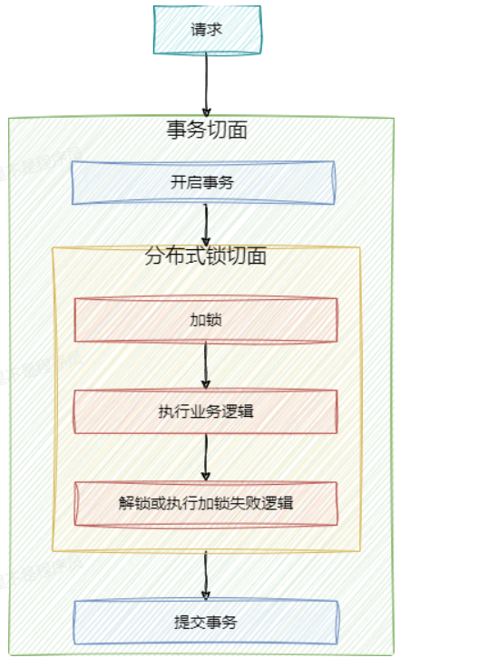
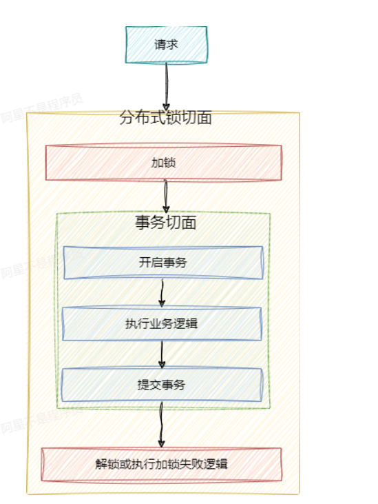

# 大麦项目笔记——知识点整理

## 函数式接口

### 四种函数式接口

函数式接口的作用是通过抽象方法把方法编程Lambda表达式，简化编程。

常用的四种函数式接口：

1. Function——转化接口

   ```java
   @FunctionalInterface
   public interface Function<T, R> {
   
       /**
        * Applies this function to the given argument.
        *
        * @param t the function argument
        * @return the function result
        */
       R apply(T t);
   
   }
   
   // 测试代码
   import java.util.Scanner;
   import java.util.function.Function;
   
   public class FunctionTest {
       public static void main(String[] args) {
           processInput("这是function测试",str -> "1111:"+str);
       }
   
       public static void processInput(String input,Function<String,String> function) {
           System.out.println(function.apply(input));
       }
   }
   
   ```

   Function强调的是转化功能，通过定制入参的类型和出参的类型，以及Lambda表达式来指定函数功能。

2. Consumer——消费接口

   ```java
   import java.util.function.Consumer;
   
   public class ConsumerTest {
       public static void main(String[] args) {
           Consumer<String> consumer = string -> System.out.println(string);
           consumer.accept("hello");
       }
   }
   
   ```

   Consumer强调的是进行消费，因此没有出参

3. Supplier——提供接口

   ```java
   import java.util.function.Supplier;
   
   public class SupplierTest {
       public static void main(String[] args) {
           Supplier<String> supplier = () -> "hello";
           System.out.println(supplier.get());
       }
   }
   
   ```

4. Predicate——断言功能

   ```java
   import java.util.function.Predicate;
   
   public class PredicateTest {
       public static void main(String[] args) {
           Predicate<Integer> predicate = (number) -> number % 2 == 0;
           System.out.println(predicate.test(4));
       }
   }
   
   ```

### 项目中的应用

对 redis 的封装用到了函数式接口，执行查缓存，如果缓存为空，就查数据库的逻辑，减少了代码量

```java
public <T> T get(RedisKeyBuild redisKeyBuild, Class<T> clazz, Supplier<T> supplier, long ttl, TimeUnit timeUnit) {
    T t = get(redisKeyBuild, clazz);
    if (CacheUtil.isEmpty(t)) {
        t = supplier.get();
        if (CacheUtil.isEmpty(t)) {
            return null;
        }
        set(redisKeyBuild,t,ttl,timeUnit);
    }
    return t;
}

public ProgramVo getById(Long programId) {
    return redisCache.get(RedisKeyBuild.createRedisKey(RedisKeyManage.PROGRAM,programId),
            ProgramVo.class,
            () -> createProgramVo(programId),
            EXPIRE_TIME, 
            TimeUnit.DAYS);
}

private ProgramVo createProgramVo(long programId){
    ProgramVo programVo = new ProgramVo();
    Program program = 
            Optional.ofNullable(programMapper.selectById(programId))
                    .orElseThrow(() -> new DaMaiFrameException(BaseCode.PROGRAM_NOT_EXIST));
    BeanUtil.copyProperties(program,programVo);
    AreaGetDto areaGetDto = new AreaGetDto();
    areaGetDto.setId(program.getAreaId());
    ApiResponse<AreaVo> areaResponse = baseDataClient.getById(areaGetDto);
    if (Objects.equals(areaResponse.getCode(), ApiResponse.ok().getCode())) {
        if (Objects.nonNull(areaResponse.getData())) {
            programVo.setAreaName(areaResponse.getData().getName());
        }
    }else {
        log.error("base-data rpc getById error areaResponse:{}", JSON.toJSONString(areaResponse));
    }
    return programVo;
}
```

## 分布式锁

分布式锁+事务的方式，可能会导致数据正确性出现问题

具体流程如下：



Spring事务本质上是利用AOP进行的，使用**事务覆盖分布式锁**，则分布式锁执行完业务进行**提交事务的过程**中可以会由于网络波动导致**事务还没提交但是另一个线程已经获取到锁**，这时候操作的数据就是**脏数据**，会造成数据不一致性。

解决：

导致出现数据不一致的原因是锁的范围太小，因此扩大锁的范围，保证在事务提交之前，锁不会释放即可。



解决：

1. 将锁的切面放在controller的方法上，这样锁的切面肯定会先于事务切面执行（如果没有把分布式锁做成AOP的情况）
2. 如果锁的切面和事务切面在一个方法上，那么指定锁切面的order值，比事务切面order值小即可(事务切面order默认为Integer.MAX_VALUE)（把分布式锁做成注解AOP，也方便了管理）
