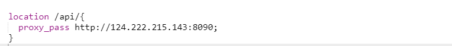

# 项目部署笔记

## Docker篇

### 下载镜像

下载镜像可以从docker镜像站中下载：

1. 指定镜像站：docker pull <镜像站>/<镜像名>:[版本号]

   常用镜像站：

   ```json
   {
       "registry-mirrors": [
           "https:#docker.m.daocloud.io",
           "https:#docker.1panel.live",
           "https:#hub.rat.dev"
       ]
   }
   ```

   常用命令：docker pull hub.rat.dev/<镜像名>:[版本号]

2. 

###镜像改名

注意docker tag会重新创建一个副本，**删除不想要的副本即可**

docker tag <旧镜像名>:<旧标签> <新镜像名>:<新标签>

示例：docker tag hub.rat.dev/bladex/sentinel-dashboard:1.8.5 sentinel-dashboard:1.8.5

### 删除镜像

docker rmi <镜像名>

示例：docker rmi hub.rat.dev/bladex/sentinel-dashboard:1.8.5

### 启动镜像

不进行挂载卷的话，一般来说就是：**docker run ---- name <服务名> -d -p <主机端口>:<容器端口> --m200M d <镜像id>**

下面是一些比较重要的特殊指令：

```bash
# 限制docker应用内存
-m 500M

# 限制jvm参数(对于java镜像，比如nacos、rocketmq)
-e JVM_XMS=128m -e JVM_XMX=128m \

```


下面是命令详解：


### 查看服务

+ 单节点可以使用docker ps 查看自身的服务
+ swarm集群可以在manager中使用docker service ls 查看所有节点服务

## jar篇

### 启动jar包

jar -jar是基础的启动指令，可以加上一些参数实现后台启动和日志管理

常用命令如下：

```bash
#启动jar包常用命令
nohup java -Xms128m -Xmx128m -jar <jar包名称.jar> > <日志文件名.log> 2>&1 &

#查看日志
tail -f <日志文件名.log>

#获取进程PID
ps -ef | grep <jar包名称.jar>

#kill 进程
kill -9 <PID...>

```


## 内存篇

### 查看内存

```bash
# 查看内存占用前10的进程
ps aux --sort=-%mem | head -n 10
# 查看当前内存情况
free -h
# 查看当前占用内存最多的进程
top
```

## 进程篇

### 查看进程

```bash
# 查看端口被哪个进程占用
lsof -i :7531

```


## 常用容器篇·

### nacos

```bash
# nacos容器
docker run -d \
-e MODE=standalone \
--privileged=true \
-e JVM_XMS=128m -e JVM_XMX=128m \ #限制JVM内存
-e SPRING_DATASOURCE_PLATFORM=mysql \
-e MYSQL_SERVICE_HOST=124.222.215.143 \ #服务器地址,不能用localhost
-e MYSQL_SERVICE_PORT=3306 \
-e MYSQL_SERVICE_USER=root \
-e MYSQL_SERVICE_PASSWORD=Crq13709390514.. \ #密码
-e MYSQL_SERVICE_DB_NAME=nacos \ #账号
-e TIME_ZONE='Asia/Shanghai' \
-e NACOS_AUTH_ENABLE=true \
-v /data/nacos/logs:/home/nacos/logs \
-v /data/nacos/data:/home/nacos/data \
-v /data/nacos/conf:/home/nacos/conf \
-p 8848:8848 -p 9848:9848 -p 9849:9849 \
--name nacos --restart=always nacos/nacos-server:v2.2.3

# nacos数据持久化
/*
 Navicat Premium Data Transfer

 Source Server         : 159.75.111.41
 Source Server Type    : MySQL
 Source Server Version : 80033
 Source Host           : 159.75.111.41:3306
 Source Schema         : nacos

 Target Server Type    : MySQL
 Target Server Version : 80033
 File Encoding         : 65001

 Date: 30/03/2024 21:32:58
*/

SET NAMES utf8mb4;
SET FOREIGN_KEY_CHECKS = 0;

-- ----------------------------
-- Table structure for config_info
-- ----------------------------
DROP TABLE IF EXISTS `config_info`;
CREATE TABLE `config_info`  (
  `id` bigint(0) NOT NULL AUTO_INCREMENT COMMENT 'id',
  `data_id` varchar(255) CHARACTER SET utf8mb3 COLLATE utf8mb3_bin NOT NULL COMMENT 'data_id',
  `group_id` varchar(128) CHARACTER SET utf8mb3 COLLATE utf8mb3_bin NULL DEFAULT NULL,
  `content` longtext CHARACTER SET utf8mb3 COLLATE utf8mb3_bin NOT NULL COMMENT 'content',
  `md5` varchar(32) CHARACTER SET utf8mb3 COLLATE utf8mb3_bin NULL DEFAULT NULL COMMENT 'md5',
  `gmt_create` datetime(0) NULL DEFAULT CURRENT_TIMESTAMP(0) COMMENT '创建时间',
  `gmt_modified` datetime(0) NULL DEFAULT CURRENT_TIMESTAMP(0) COMMENT '修改时间',
  `src_user` text CHARACTER SET utf8mb3 COLLATE utf8mb3_bin NULL COMMENT 'source user',
  `src_ip` varchar(50) CHARACTER SET utf8mb3 COLLATE utf8mb3_bin NULL DEFAULT NULL COMMENT 'source ip',
  `app_name` varchar(128) CHARACTER SET utf8mb3 COLLATE utf8mb3_bin NULL DEFAULT NULL,
  `tenant_id` varchar(128) CHARACTER SET utf8mb3 COLLATE utf8mb3_bin NULL DEFAULT '' COMMENT '租户字段',
  `c_desc` varchar(256) CHARACTER SET utf8mb3 COLLATE utf8mb3_bin NULL DEFAULT NULL,
  `c_use` varchar(64) CHARACTER SET utf8mb3 COLLATE utf8mb3_bin NULL DEFAULT NULL,
  `effect` varchar(64) CHARACTER SET utf8mb3 COLLATE utf8mb3_bin NULL DEFAULT NULL,
  `type` varchar(64) CHARACTER SET utf8mb3 COLLATE utf8mb3_bin NULL DEFAULT NULL,
  `c_schema` text CHARACTER SET utf8mb3 COLLATE utf8mb3_bin NULL,
  `encrypted_data_key` text CHARACTER SET utf8mb3 COLLATE utf8mb3_bin NULL COMMENT '秘钥',
  PRIMARY KEY (`id`) USING BTREE,
  UNIQUE INDEX `uk_configinfo_datagrouptenant`(`data_id`, `group_id`, `tenant_id`) USING BTREE
) ENGINE = InnoDB AUTO_INCREMENT = 1 CHARACTER SET = utf8mb3 COLLATE = utf8mb3_bin COMMENT = 'config_info' ROW_FORMAT = Dynamic;

-- ----------------------------
-- Records of config_info
-- ----------------------------

-- ----------------------------
-- Table structure for config_info_aggr
-- ----------------------------
DROP TABLE IF EXISTS `config_info_aggr`;
CREATE TABLE `config_info_aggr`  (
  `id` bigint(0) NOT NULL AUTO_INCREMENT COMMENT 'id',
  `data_id` varchar(255) CHARACTER SET utf8mb3 COLLATE utf8mb3_bin NOT NULL COMMENT 'data_id',
  `group_id` varchar(128) CHARACTER SET utf8mb3 COLLATE utf8mb3_bin NOT NULL COMMENT 'group_id',
  `datum_id` varchar(255) CHARACTER SET utf8mb3 COLLATE utf8mb3_bin NOT NULL COMMENT 'datum_id',
  `content` longtext CHARACTER SET utf8mb3 COLLATE utf8mb3_bin NOT NULL COMMENT '内容',
  `gmt_modified` datetime(0) NULL DEFAULT NULL COMMENT '修改时间',
  `app_name` varchar(128) CHARACTER SET utf8mb3 COLLATE utf8mb3_bin NULL DEFAULT NULL,
  `tenant_id` varchar(128) CHARACTER SET utf8mb3 COLLATE utf8mb3_bin NULL DEFAULT '' COMMENT '租户字段',
  PRIMARY KEY (`id`) USING BTREE,
  UNIQUE INDEX `uk_configinfoaggr_datagrouptenantdatum`(`data_id`, `group_id`, `tenant_id`, `datum_id`) USING BTREE
) ENGINE = InnoDB AUTO_INCREMENT = 1 CHARACTER SET = utf8mb3 COLLATE = utf8mb3_bin COMMENT = '增加租户字段' ROW_FORMAT = Dynamic;

-- ----------------------------
-- Records of config_info_aggr
-- ----------------------------

-- ----------------------------
-- Table structure for config_info_beta
-- ----------------------------
DROP TABLE IF EXISTS `config_info_beta`;
CREATE TABLE `config_info_beta`  (
  `id` bigint(0) NOT NULL AUTO_INCREMENT COMMENT 'id',
  `data_id` varchar(255) CHARACTER SET utf8mb3 COLLATE utf8mb3_bin NOT NULL COMMENT 'data_id',
  `group_id` varchar(128) CHARACTER SET utf8mb3 COLLATE utf8mb3_bin NOT NULL COMMENT 'group_id',
  `app_name` varchar(128) CHARACTER SET utf8mb3 COLLATE utf8mb3_bin NULL DEFAULT NULL COMMENT 'app_name',
  `content` longtext CHARACTER SET utf8mb3 COLLATE utf8mb3_bin NOT NULL COMMENT 'content',
  `beta_ips` varchar(1024) CHARACTER SET utf8mb3 COLLATE utf8mb3_bin NULL DEFAULT NULL COMMENT 'betaIps',
  `md5` varchar(32) CHARACTER SET utf8mb3 COLLATE utf8mb3_bin NULL DEFAULT NULL COMMENT 'md5',
  `gmt_create` datetime(0) NULL DEFAULT CURRENT_TIMESTAMP(0) COMMENT '创建时间',
  `gmt_modified` datetime(0) NULL DEFAULT CURRENT_TIMESTAMP(0) COMMENT '修改时间',
  `src_user` text CHARACTER SET utf8mb3 COLLATE utf8mb3_bin NULL COMMENT 'source user',
  `src_ip` varchar(50) CHARACTER SET utf8mb3 COLLATE utf8mb3_bin NULL DEFAULT NULL COMMENT 'source ip',
  `tenant_id` varchar(128) CHARACTER SET utf8mb3 COLLATE utf8mb3_bin NULL DEFAULT '' COMMENT '租户字段',
  `encrypted_data_key` text CHARACTER SET utf8mb3 COLLATE utf8mb3_bin NULL COMMENT '秘钥',
  PRIMARY KEY (`id`) USING BTREE,
  UNIQUE INDEX `uk_configinfobeta_datagrouptenant`(`data_id`, `group_id`, `tenant_id`) USING BTREE
) ENGINE = InnoDB AUTO_INCREMENT = 1 CHARACTER SET = utf8mb3 COLLATE = utf8mb3_bin COMMENT = 'config_info_beta' ROW_FORMAT = Dynamic;

-- ----------------------------
-- Records of config_info_beta
-- ----------------------------

-- ----------------------------
-- Table structure for config_info_tag
-- ----------------------------
DROP TABLE IF EXISTS `config_info_tag`;
CREATE TABLE `config_info_tag`  (
  `id` bigint(0) NOT NULL AUTO_INCREMENT COMMENT 'id',
  `data_id` varchar(255) CHARACTER SET utf8mb3 COLLATE utf8mb3_bin NOT NULL COMMENT 'data_id',
  `group_id` varchar(128) CHARACTER SET utf8mb3 COLLATE utf8mb3_bin NOT NULL COMMENT 'group_id',
  `tenant_id` varchar(128) CHARACTER SET utf8mb3 COLLATE utf8mb3_bin NULL DEFAULT '' COMMENT 'tenant_id',
  `tag_id` varchar(128) CHARACTER SET utf8mb3 COLLATE utf8mb3_bin NOT NULL COMMENT 'tag_id',
  `app_name` varchar(128) CHARACTER SET utf8mb3 COLLATE utf8mb3_bin NULL DEFAULT NULL COMMENT 'app_name',
  `content` longtext CHARACTER SET utf8mb3 COLLATE utf8mb3_bin NOT NULL COMMENT 'content',
  `md5` varchar(32) CHARACTER SET utf8mb3 COLLATE utf8mb3_bin NULL DEFAULT NULL COMMENT 'md5',
  `gmt_create` datetime(0) NULL DEFAULT CURRENT_TIMESTAMP(0) COMMENT '创建时间',
  `gmt_modified` datetime(0) NULL DEFAULT CURRENT_TIMESTAMP(0) COMMENT '修改时间',
  `src_user` text CHARACTER SET utf8mb3 COLLATE utf8mb3_bin NULL COMMENT 'source user',
  `src_ip` varchar(50) CHARACTER SET utf8mb3 COLLATE utf8mb3_bin NULL DEFAULT NULL COMMENT 'source ip',
  PRIMARY KEY (`id`) USING BTREE,
  UNIQUE INDEX `uk_configinfotag_datagrouptenanttag`(`data_id`, `group_id`, `tenant_id`, `tag_id`) USING BTREE
) ENGINE = InnoDB AUTO_INCREMENT = 1 CHARACTER SET = utf8mb3 COLLATE = utf8mb3_bin COMMENT = 'config_info_tag' ROW_FORMAT = Dynamic;

-- ----------------------------
-- Records of config_info_tag
-- ----------------------------

-- ----------------------------
-- Table structure for config_tags_relation
-- ----------------------------
DROP TABLE IF EXISTS `config_tags_relation`;
CREATE TABLE `config_tags_relation`  (
  `id` bigint(0) NOT NULL COMMENT 'id',
  `tag_name` varchar(128) CHARACTER SET utf8mb3 COLLATE utf8mb3_bin NOT NULL COMMENT 'tag_name',
  `tag_type` varchar(64) CHARACTER SET utf8mb3 COLLATE utf8mb3_bin NULL DEFAULT NULL COMMENT 'tag_type',
  `data_id` varchar(255) CHARACTER SET utf8mb3 COLLATE utf8mb3_bin NOT NULL COMMENT 'data_id',
  `group_id` varchar(128) CHARACTER SET utf8mb3 COLLATE utf8mb3_bin NOT NULL COMMENT 'group_id',
  `tenant_id` varchar(128) CHARACTER SET utf8mb3 COLLATE utf8mb3_bin NULL DEFAULT '' COMMENT 'tenant_id',
  `nid` bigint(0) NOT NULL AUTO_INCREMENT,
  PRIMARY KEY (`nid`) USING BTREE,
  UNIQUE INDEX `uk_configtagrelation_configidtag`(`id`, `tag_name`, `tag_type`) USING BTREE,
  INDEX `idx_tenant_id`(`tenant_id`) USING BTREE
) ENGINE = InnoDB AUTO_INCREMENT = 1 CHARACTER SET = utf8mb3 COLLATE = utf8mb3_bin COMMENT = 'config_tag_relation' ROW_FORMAT = Dynamic;

-- ----------------------------
-- Records of config_tags_relation
-- ----------------------------

-- ----------------------------
-- Table structure for group_capacity
-- ----------------------------
DROP TABLE IF EXISTS `group_capacity`;
CREATE TABLE `group_capacity`  (
  `id` bigint(0) UNSIGNED NOT NULL AUTO_INCREMENT COMMENT '主键ID',
  `group_id` varchar(128) CHARACTER SET utf8mb3 COLLATE utf8mb3_bin NOT NULL DEFAULT '' COMMENT 'Group ID，空字符表示整个集群',
  `quota` int(0) UNSIGNED NOT NULL DEFAULT 0 COMMENT '配额，0表示使用默认值',
  `usage` int(0) UNSIGNED NOT NULL DEFAULT 0 COMMENT '使用量',
  `max_size` int(0) UNSIGNED NOT NULL DEFAULT 0 COMMENT '单个配置大小上限，单位为字节，0表示使用默认值',
  `max_aggr_count` int(0) UNSIGNED NOT NULL DEFAULT 0 COMMENT '聚合子配置最大个数，，0表示使用默认值',
  `max_aggr_size` int(0) UNSIGNED NOT NULL DEFAULT 0 COMMENT '单个聚合数据的子配置大小上限，单位为字节，0表示使用默认值',
  `max_history_count` int(0) UNSIGNED NOT NULL DEFAULT 0 COMMENT '最大变更历史数量',
  `gmt_create` datetime(0) NULL DEFAULT CURRENT_TIMESTAMP(0) COMMENT '创建时间',
  `gmt_modified` datetime(0) NULL DEFAULT CURRENT_TIMESTAMP(0) COMMENT '修改时间',
  PRIMARY KEY (`id`) USING BTREE,
  UNIQUE INDEX `uk_group_id`(`group_id`) USING BTREE
) ENGINE = InnoDB AUTO_INCREMENT = 1 CHARACTER SET = utf8mb3 COLLATE = utf8mb3_bin COMMENT = '集群、各Group容量信息表' ROW_FORMAT = Dynamic;

-- ----------------------------
-- Records of group_capacity
-- ----------------------------

-- ----------------------------
-- Table structure for his_config_info
-- ----------------------------
DROP TABLE IF EXISTS `his_config_info`;
CREATE TABLE `his_config_info`  (
  `id` bigint(0) UNSIGNED NOT NULL,
  `nid` bigint(0) UNSIGNED NOT NULL AUTO_INCREMENT,
  `data_id` varchar(255) CHARACTER SET utf8mb3 COLLATE utf8mb3_bin NOT NULL,
  `group_id` varchar(128) CHARACTER SET utf8mb3 COLLATE utf8mb3_bin NOT NULL,
  `app_name` varchar(128) CHARACTER SET utf8mb3 COLLATE utf8mb3_bin NULL DEFAULT NULL COMMENT 'app_name',
  `content` longtext CHARACTER SET utf8mb3 COLLATE utf8mb3_bin NOT NULL,
  `md5` varchar(32) CHARACTER SET utf8mb3 COLLATE utf8mb3_bin NULL DEFAULT NULL,
  `gmt_create` datetime(0) NULL DEFAULT CURRENT_TIMESTAMP(0),
  `gmt_modified` datetime(0) NULL DEFAULT CURRENT_TIMESTAMP(0),
  `src_user` text CHARACTER SET utf8mb3 COLLATE utf8mb3_bin NULL,
  `src_ip` varchar(50) CHARACTER SET utf8mb3 COLLATE utf8mb3_bin NULL DEFAULT NULL,
  `op_type` char(10) CHARACTER SET utf8mb3 COLLATE utf8mb3_bin NULL DEFAULT NULL,
  `tenant_id` varchar(128) CHARACTER SET utf8mb3 COLLATE utf8mb3_bin NULL DEFAULT '' COMMENT '租户字段',
  `encrypted_data_key` text CHARACTER SET utf8mb3 COLLATE utf8mb3_bin NULL COMMENT '秘钥',
  PRIMARY KEY (`nid`) USING BTREE,
  INDEX `idx_gmt_create`(`gmt_create`) USING BTREE,
  INDEX `idx_gmt_modified`(`gmt_modified`) USING BTREE,
  INDEX `idx_did`(`data_id`) USING BTREE
) ENGINE = InnoDB AUTO_INCREMENT = 1 CHARACTER SET = utf8mb3 COLLATE = utf8mb3_bin COMMENT = '多租户改造' ROW_FORMAT = Dynamic;

-- ----------------------------
-- Records of his_config_info
-- ----------------------------
INSERT INTO `his_config_info` VALUES (0, 1, '132', 'DEFAULT_GROUP', '', '123', '202cb962ac59075b964b07152d234b70', '2024-03-30 21:32:28', '2024-03-30 21:32:28', NULL, '212.87.195.237', 'I', '', NULL);
INSERT INTO `his_config_info` VALUES (1, 2, '132', 'DEFAULT_GROUP', '', '123', '202cb962ac59075b964b07152d234b70', '2024-03-30 21:32:36', '2024-03-30 21:32:36', NULL, '212.87.195.237', 'D', '', NULL);

-- ----------------------------
-- Table structure for permissions
-- ----------------------------
DROP TABLE IF EXISTS `permissions`;
CREATE TABLE `permissions`  (
  `role` varchar(50) CHARACTER SET utf8mb4 COLLATE utf8mb4_general_ci NOT NULL,
  `resource` varchar(255) CHARACTER SET utf8mb4 COLLATE utf8mb4_general_ci NOT NULL,
  `action` varchar(8) CHARACTER SET utf8mb4 COLLATE utf8mb4_general_ci NOT NULL,
  UNIQUE INDEX `uk_role_permission`(`role`, `resource`, `action`) USING BTREE
) ENGINE = InnoDB CHARACTER SET = utf8mb4 COLLATE = utf8mb4_general_ci ROW_FORMAT = Dynamic;

-- ----------------------------
-- Records of permissions
-- ----------------------------

-- ----------------------------
-- Table structure for roles
-- ----------------------------
DROP TABLE IF EXISTS `roles`;
CREATE TABLE `roles`  (
  `username` varchar(50) CHARACTER SET utf8mb4 COLLATE utf8mb4_general_ci NOT NULL,
  `role` varchar(50) CHARACTER SET utf8mb4 COLLATE utf8mb4_general_ci NOT NULL,
  UNIQUE INDEX `idx_user_role`(`username`, `role`) USING BTREE
) ENGINE = InnoDB CHARACTER SET = utf8mb4 COLLATE = utf8mb4_general_ci ROW_FORMAT = Dynamic;

-- ----------------------------
-- Records of roles
-- ----------------------------
INSERT INTO `roles` VALUES ('nacos', 'ROLE_ADMIN');

-- ----------------------------
-- Table structure for tenant_capacity
-- ----------------------------
DROP TABLE IF EXISTS `tenant_capacity`;
CREATE TABLE `tenant_capacity`  (
  `id` bigint(0) UNSIGNED NOT NULL AUTO_INCREMENT COMMENT '主键ID',
  `tenant_id` varchar(128) CHARACTER SET utf8mb3 COLLATE utf8mb3_bin NOT NULL DEFAULT '' COMMENT 'Tenant ID',
  `quota` int(0) UNSIGNED NOT NULL DEFAULT 0 COMMENT '配额，0表示使用默认值',
  `usage` int(0) UNSIGNED NOT NULL DEFAULT 0 COMMENT '使用量',
  `max_size` int(0) UNSIGNED NOT NULL DEFAULT 0 COMMENT '单个配置大小上限，单位为字节，0表示使用默认值',
  `max_aggr_count` int(0) UNSIGNED NOT NULL DEFAULT 0 COMMENT '聚合子配置最大个数',
  `max_aggr_size` int(0) UNSIGNED NOT NULL DEFAULT 0 COMMENT '单个聚合数据的子配置大小上限，单位为字节，0表示使用默认值',
  `max_history_count` int(0) UNSIGNED NOT NULL DEFAULT 0 COMMENT '最大变更历史数量',
  `gmt_create` datetime(0) NULL DEFAULT CURRENT_TIMESTAMP(0) COMMENT '创建时间',
  `gmt_modified` datetime(0) NULL DEFAULT CURRENT_TIMESTAMP(0) COMMENT '修改时间',
  PRIMARY KEY (`id`) USING BTREE,
  UNIQUE INDEX `uk_tenant_id`(`tenant_id`) USING BTREE
) ENGINE = InnoDB AUTO_INCREMENT = 1 CHARACTER SET = utf8mb3 COLLATE = utf8mb3_bin COMMENT = '租户容量信息表' ROW_FORMAT = Dynamic;

-- ----------------------------
-- Records of tenant_capacity
-- ----------------------------

-- ----------------------------
-- Table structure for tenant_info
-- ----------------------------
DROP TABLE IF EXISTS `tenant_info`;
CREATE TABLE `tenant_info`  (
  `id` bigint(0) NOT NULL AUTO_INCREMENT COMMENT 'id',
  `kp` varchar(128) CHARACTER SET utf8mb3 COLLATE utf8mb3_bin NOT NULL COMMENT 'kp',
  `tenant_id` varchar(128) CHARACTER SET utf8mb3 COLLATE utf8mb3_bin NULL DEFAULT '' COMMENT 'tenant_id',
  `tenant_name` varchar(128) CHARACTER SET utf8mb3 COLLATE utf8mb3_bin NULL DEFAULT '' COMMENT 'tenant_name',
  `tenant_desc` varchar(256) CHARACTER SET utf8mb3 COLLATE utf8mb3_bin NULL DEFAULT NULL COMMENT 'tenant_desc',
  `create_source` varchar(32) CHARACTER SET utf8mb3 COLLATE utf8mb3_bin NULL DEFAULT NULL COMMENT 'create_source',
  `gmt_create` bigint(0) NULL DEFAULT NULL COMMENT '创建时间',
  `gmt_modified` bigint(0) NULL DEFAULT NULL COMMENT '修改时间',
  PRIMARY KEY (`id`) USING BTREE,
  UNIQUE INDEX `uk_tenant_info_kptenantid`(`kp`, `tenant_id`) USING BTREE,
  INDEX `idx_tenant_id`(`tenant_id`) USING BTREE
) ENGINE = InnoDB AUTO_INCREMENT = 1 CHARACTER SET = utf8mb3 COLLATE = utf8mb3_bin COMMENT = 'tenant_info' ROW_FORMAT = Dynamic;

-- ----------------------------
-- Records of tenant_info
-- ----------------------------

-- ----------------------------
-- Table structure for users
-- ----------------------------
DROP TABLE IF EXISTS `users`;
CREATE TABLE `users`  (
  `username` varchar(50) CHARACTER SET utf8mb4 COLLATE utf8mb4_general_ci NOT NULL,
  `password` varchar(500) CHARACTER SET utf8mb4 COLLATE utf8mb4_general_ci NOT NULL,
  `enabled` tinyint(1) NOT NULL,
  PRIMARY KEY (`username`) USING BTREE
) ENGINE = InnoDB CHARACTER SET = utf8mb4 COLLATE = utf8mb4_general_ci ROW_FORMAT = Dynamic;

-- ----------------------------
-- Records of users
-- ----------------------------
INSERT INTO `users` VALUES ('nacos', '$2a$10$EuWPZHzz32dJN7jexM34MOeYirDdFAZm2kuWj7VEOJhhZkDrxfvUu', 1);

SET FOREIGN_KEY_CHECKS = 1;


```

## CORS篇

### 前端Https对接后端Http接口

1. 前端使用nginx反向代理

   示例：



​	则前端请求https://rickey-qiapi.cn/api/user/login -> nginx -> http://124.222.215.143:8090/api/user/login 

​	可以屏蔽前端由于跨域产生的CORS错误和Cookie携带问题，对于前端而言就是从https://rickey-qiapi.cn获取	信息。

2. 后端配置跨域+统一API网关（非必要）

​	后端如果拥有全局网关，则nginx反向代理的配置成本会降低很多，只需配置前端请求到后端网关地址的代理

