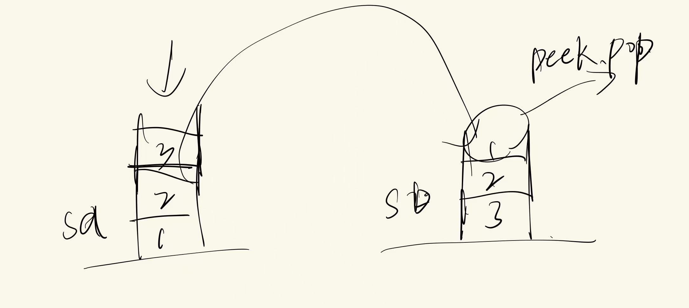

# 232.用栈实现队列

## 题目描述：

请你仅使用两个栈实现先入先出队列。队列应当支持一般队列支持的所有操作（`push`、`pop`、`peek`、`empty`）：


实现 `MyQueue` 类：

+ `void push(int x)` 将元素 x 推到队列的末尾
+ `int pop()` 从队列的开头移除并返回元素
+ `int peek()` 返回队列开头的元素
+ `boolean empty()` 如果队列为空，返回 `true` ；否则，返回 `false`

**说明：**

+ 你 **只能** 使用标准的栈操作 —— 也就是只有 `push to top`, `peek/pop from top`, `size`, 和 `is empty` 操作是合法的。
+ 你所使用的语言也许不支持栈。你可以使用 list 或者 deque（双端队列）来模拟一个栈，只要是标准的栈操作即可。

 

**示例 1：**

```
输入：
["MyQueue", "push", "push", "peek", "pop", "empty"]
[[], [1], [2], [], [], []]
输出：
[null, null, null, 1, 1, false]

解释：
MyQueue myQueue = new MyQueue();
myQueue.push(1); // queue is: [1]
myQueue.push(2); // queue is: [1, 2] (leftmost is front of the queue)
myQueue.peek(); // return 1
myQueue.pop(); // return 1, queue is [2]
myQueue.empty(); // return false
```

 

**提示：**

+ `1 <= x <= 9`
+ 最多调用 `100` 次 `push`、`pop`、`peek` 和 `empty`
+ 假设所有操作都是有效的 （例如，一个空的队列不会调用 `pop` 或者 `peek` 操作）

## 解题思路：

利用两个栈实现队列，其中的`sa`做标准栈，`sb`做缓存的逆序栈，当元素入队的时候，放到标准栈。如果是需要`pop()`或者`peek()`，就到`sb`中去寻找所缓存的逆序栈（缓存队列），直接取`peek()`和`pop()`，就能得到想要的元素，最后判断Empty()，就是判断`sa`和`sb`是不是都是空了。



## 代码：

```java
class MyQueue {
    Stack<Integer> sa;
    Stack<Integer> sb;

    public MyQueue() {
        sa=new Stack<>();
        sb=new Stack<>();
    }
    
    public void push(int x) {
        // 入队就直接加到sa
        sa.push(x);
    }
    
    public int pop() {
        int peek= peek();
        sb.pop();
        return peek;
    }
    
    public int peek() {
        if(!sb.isEmpty()) return sb.peek();
        if(sa.isEmpty()) return -1;
        while(!sa.isEmpty()){
            sb.push(sa.pop());
        }
        return sb.peek();
    }

    
    public boolean empty() {
        return sa.isEmpty()&&sb.isEmpty();
    }
}

/**
 * Your MyQueue object will be instantiated and called as such:
 * MyQueue obj = new MyQueue();
 * obj.push(x);
 * int param_2 = obj.pop();
 * int param_3 = obj.peek();
 * boolean param_4 = obj.empty();
 */

```

